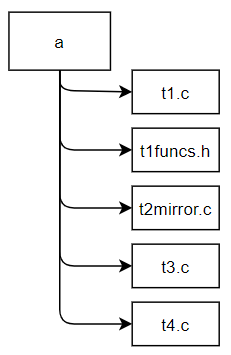

# Assignment 02: functions, arrays, C character strings, arguments to main, and header files

Due: 2021-06-21 11:59pm.

Download the files for this assignment [here](./files.zip) (or from the [CMPT 127 D100/D200/D300 Canvas page](https://canvas.sfu.ca/courses/62984) > Assignments).

**REMEMBER**:
- Reference [lab 02](../../labs/02) for help!
- DO THE PRACTICE problems! They **directly** help you do the assignment tasks!
- Assignments are to be done individually.
- You may submit/resubmit the assignment as many times as you need before the designated due date (please don't do it too often though).
- The internet is your friend :) Search for documentation online and make sure to understand why things work the way they do!

**CONTENTS**: for this assignment, you will complete the following tasks.
- [Task 01](#task-01)
- [Task 02](#task-02)
- [Task 03](#task-03)
- [Task 04](#task-04)

Your assignment will be graded according to this [**marking rubric**](#marking-rubric).

## Task 01

**REQUIREMENT**: You will write to file `t1funcs.h` and edit file `t1.c`.
- Create a file called `t1funcs.h` that contain function declarations for all the functions in `t1funcs.c`.
- Edit the file `t1.c` to `#include` the new header file.

**TESTING**: the finished code must compile with this command with no errors or warnings:
```
$ make t1 # OR gcc -Werror -Wfatal-errors -g -o t1 t1.c t1funcs.c (see Makefile)
$ ./t1
The sum of our numbers is 8.
The quotient of our numbers is 3.
```
(see? Makefiles saves your `gcc` command so you don't have to type this long thing over and over again, convenient huh :D)

**REMEMBER**: header files contain function declarations, these are the same as a function definition except the braces and everything in the braces are replaced by a `;`.


## Task 02

**REQUIREMENT**: you will write in file `t2mirror.c`, the definition of a single function `mirror()` associated with the following function declaration:
```C
int mirror(int arr1[], int arr2[], unsigned int len);
```
- INPUT: The `mirror()` function has the following inputu arguments:
    - Arrays `arr1` and `arr2` are both of length `len`, and contain arbitrary integer values.
    - `len` can have any unsigned int value, including 0.
- OUTPUT: `mirror()` should return 1 iff arrays `arr1` and `arr2` contain the same values in the reverse order, or 0 otherwise. 
    - If `len` is 0 then `mirror()` should return 1 (since the arrays have the same - empty - contents).
- You must not change the contents of the arrays.

**TESTING**: use `t2.c` to test your function by editing the arrays `a1` and `a2` and by running:
```
$ make t2 # OR gcc -Werror -Wfatal-errors -g -o t2 t2.c t2mirror.c (see Makefile)
$ ./t2
```
(see? Makefiles saves your `gcc` command so you don't have to type this long thing over and over again, convenient huh :D)

**EXAMPLE**

Examples of arrays for which `mirror` should return 1 (i.e. the two arrays have reverse ordering):

```C
arr1 = {10,15,20}, arr2 = {20,15,10}
arr1 = {100}, arr2 = {100}
arr1 = {5,2,2,3,4,5,5}, arr2 = {5,5,4,3,2,2,5}
arr1 = {}, arr2 = {} (i.e. len = 0)
```

Examples of arrays for which `mirror` should return 0 (i.e. the two arrays do not contain the same elements and even if they do, they do not  reverse ordering):

```C
arr1 = {1,1}, arr2 = {1,2}
arr1 = {10,15,20}, arr2 = {10,15,20}
arr1 = {1,2,3,4,5}, arr2 = {5,3,4,1,2}
arr1 = {1,2,3,4,5}, arr2 = {5,3,4,2,2}
```

## Task 03

**REQUIREMENT**: you will write a program to file `t3.c`.
- INPUT: your `t3.c` program takes two text strings as arguments.
    - You can assume your strings are of length at least 1.
- OUTPUT: `t3.c` prints "true" followed by a newline if the second string is entirely **in the same order but not necessarily continuously** contained within the first, or "false" followed by a newline otherwise.

Recall that in lab 02 practice 03, you made a similar program; take caution not to confuse the requirements of the practice problem and this task!

**TESTING**: you can test your program by running:
```
$ make t3 # OR gcc -Werror -Wfatal-errors -g -o t3 t3.c (see Makefile)
$ ./t3 "string1" "string2"
```
(see? Makefiles saves your `gcc` command so you don't have to type this long thing over and over again, convenient huh :D)

**EXAMPLE**

Example runs:

```
$ ./t3 "I have a really bad feeling about this" "had fling"
true
$ ./t3 "To be or not to be" "To not be"
true
$ ./t3 "To be or not to be" "be to not"
false
$ ./t3 "I am the walrus" "I am the walrus"
true
$ ./t3 "the walrus" "I am the walrus"
false
$ ./t3 "kmjnhbvc45&^$bn" "."
false
```

To expand on the first example, it is true because: "I \[ha\]ve a really ba\[d f\]ee\[ling\] about this" "had fling"


## Task 04

**REQUIREMENT**: you will write a program to `t4.c`.
- INPUT: `t4.c` takes two program arguments of type C string: `str1` and `str2`. The program would also read from stdin, a text file. 
    - Every byte read from stdin counts as a character.
    - Words are defined as contiguous sequences of letters (a through z, A through Z) and the apostrophe (', value 39 decimal) separated by any character outside these ranges.
    - You can assume your strings are of length at least 1.
- OUTPUT: `t4.c` should output to console, the number of times the `str1` and `str2` occurs in the text document (continuously, like in practice 03) in two separate lines.

Recall escape characters --- may be helpful ;)

**TESTING**: your program should work as follows:
```
$ make t4 # OR gcc -Werror -Wfatal-errors -g -o t4 t4.c (see Makefile)
$ ./t4 as to < t4prince.txt
```
(see? Makefiles saves your `gcc` command so you don't have to type this long thing over and over again, convenient huh :D)

**HINT**:
- use `strcmp()`, look it up!
- to keep track of the words you are reading from standard input, initialize a C string with, e.g. 200, characters plus an integer keeping track of how long your C string currently is; for example:

```C
int i = 0; // keeps track of the length of the str + 1
char* str[200]; // assuming a word doesn't exceed 200 characters
char last = getchar();
while (last != EOF) {
    char current = getchar();

    if (!isalpha(last) && isalpha(current)) {
        str[i] = '\0';
        for (j in /*ref_strings*/) {
            if (strcmp(ref, str) == 0) {
                /* add 1 to counter*/
                break;
            }
        }
        
    } else {
        str[i++] = current;
    }
    last = current;
}
```

**EXAMPLE**

Example outputs include:

```
$ ./t4 r in < t4beatles.txt
r : 2
in : 1

$ ./t4 go ge < t4beatles.txt
go : 1
ge : 2
```


# Make sure your code is readable!

Please make sure you follow good coding habits while you are coding:
- indents: use consistent indenting conventions e.g. if you decide to use 2 spaces for an indent, do that across all your tasks.
- readable variable names: the name of a variable explains why you made it if it is not obvious already (likely not ;). You can also add a comment explaining what it is!
- comments at the top + inline: comments at the top is the block I give you to fill in your name, date, etc. Comments inline are comments explaining what your code does, e.g.

```C
// author: alice yue; aya43; 301196607
// date:2021/5/29
// input: void (from main (<<void>>))
// output: int (from <<int>> main (void))
// description: prints the product of multiple 
//     user given integers to standard output.

#include <stdio.h>

int main(void) {
    // declare a variable to hold user input
    float i; 
  
    // declare a variable to hold the product
    float prod;

    // ask and scan for a user input
    printf("Provide floats separated by a line:\n");
    scanf("%f", &a);

    // while the user input is not 0, calculate a cumulative product
    while (a!=0) {
        prod = prod*a;
        scanf("%f", &a);
    }

    // print the product to standard output
    printf("The product of your values is %0.2f\n", product);
    
    return 0;
}
```

# Submission

Make sure you have the following files ready for submission and that they are named appropriately, otherwise they won't be graded.
- Task 01: `t1.c`, `t1funcs.h`
- Task 02: `t2mirror.c`
- Task 03: `t3.c`
- Task 04: `t4.c`

Compress these files into a zip file called `a.zip`; you can do this by using the following command from console:
```
$ make submit
```

i.e. you should have ONE file called `a.zip` containing the files listed above (you can open your `a.zip` file to verify you have the correct files in it) (diagram curtosy of Glory!):



Upload `a.zip` to the appropriate assignment submission page on the [CMPT 127 D100/D200/D300 Canvas assignments page](https://canvas.sfu.ca/courses/62984/assignments).

# Marking rubric


| Task | Criteria                                      | Points |
|------|-----------------------------------------------|--------|
| All  | The assigment is submitted in the appropriate format (i.e. the submitted files are named as specified and they are compressed into .zip format and uploaded onto canvas). | 1 |
|      | Source code is readable (i.e. student name and program description at the top of program files, variable names are self-descriptive and consistent, comments describing what code does is available where appropriate, indentatations are consistent). | 0.5 |
| 01   | `t1funcs.h` contains the function declarations for the functions in `t1funcs.c`. | 0.5 |
|      | `t1.c` contains an include statement for `t1funcs.h`. | 0.5 | 
| 02   | Program works as intended (i.e. outputs false and true for the first and second half of the tests in `t2.c` respectively). | 2 |
| 03   | Program works as intended.                    | 2.5    |
| 04   | Program works as intended.                    | 2      |
|      | Program properly uses `scanf` to take as input, two C strings and a text file. | 0.5 |
|      | Program properly initializes and uses arrays. | 0.5 |
| Total|                                               | 10     |
