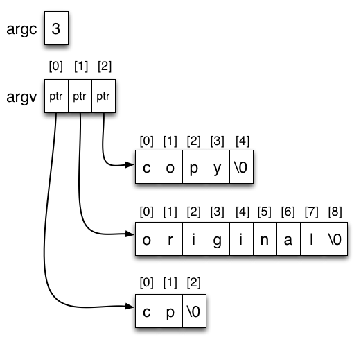
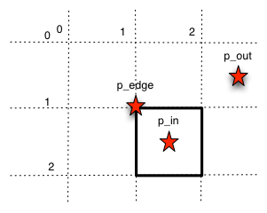

# Lab 2: Functions, Arrays, C character strings, arguments to main, header files

Open lab 01 on [repl.it](https://replit.com/team/202105cmpt127) > Team Projects > 02_lab

Review "Guide"s and accompanying slides (we will go over these during the lab lecture).

1. Create and use functions
2. Create and use statically allocated arrays
3. Create and use text strings (null-terminated character arrays)
4. Build programs from multiple source files
5. Create and use header files containing function declarations
6. Use arguments passed to `main()`
7. Compile a program from two source files.
8. Test a function for correctness.

Try "Practice" problems on repl.it; these will NOT be graded.


# Function definitions, declarations, and header files

## Guide

**Functions** (not to be confused with functions in mathematics): C is a [structured, procedural programming language](http://en.wikipedia.org/wiki/Procedural_programming_language). This means that C supports functions: isolated, self-contained blocks of code that can be re-used as components of larger programs. Other languages may call functions _procedures, subroutines_, or _methods_.

**Encapsulation** is a trait of well-designed functions where you can often use it for what it does, and ignore the internal details of how it works. This makes it feasible for humans to write complex programs by breaking them down into small, more manageable pieces.

You have already used several functions provided by the standard library, such as `printf`, without seeing how they were implemented.

### Function syntax

```C
type functionName(type arg_name1 [, type arg_name2, ...]) {
        // code-block function body enclosed by curly braces
}
```

Let's look at an example implementation of the function.

File: `p1funcs.c`
```C
// returns the larger of the two arguments
int max(int int1, int int2) {

    // let's assume int2 is the larger integer
    int larger = int2;
    
    // if int2 isn't the larger integer, then int1 is the larger integer
    if (int1 > int2) {
        larger = int1;
    }
    return larger;
}
```

File: `p1.c`
```C
int main(void) {
    int num1 = 11;
    int num2 = 12;

    // use max to test which integer is larger
    printf("The max of our numbers is %d\n", max(num1, num2));
    return 0;
}
```

Let's read our `max` function top-to-bottom, left-to-right: `int max(int int1, int int2)`:
- `int` is the _return value_ of running this function is of type `int`. If the return type is `void`, we can omit the `return` statement, The function will finish at the end of the code block and return nothing.
- `max` is the name of the function.
- arguments `int1` and `int2` are what the function takes as input; in this case, the input is two integer arguments called `int1` and `int2`; function definitions can specify an **arbitrary number of arguments**.
- The _body_ of the function, i.e. the code that will execute when the function is called, is written between `{...}`.
- `return` ..., or the value of the expression to the right of keyword `return` is the function's _return value_, or what the function outputs. Functions can only have **one return value**.

In `int main(void)`,
- Calling a function: the function `max` is _called_ (like this: `max(num1, num2)`) in `printf`.
    - Input: the values of integers `num1` and `num2` are assigned to `int1` and `int2` inside `max()`.
    - Output: `max` does its work and the return value is passed as the second argument to `printf()`.

Other important notes on functions:
- In general a function may call any including itself (e.g. `max` is called inside `main()`, both are functions).
- A function can only be called below its definition because the compiler reads the source file from top to bottom, it doesn't know what it hasn't seen!

**Header files**

When you start writing lots of functions, it is good practice to break up your bode into multiple source files.

For example, in your working directory you have the source files `p1funcs.c`, containing useful function definitions, and `p1.c`, containing your `main()` program. To use all of these files together, you would have to give your compiler multiple source files. 

As it is now, the compiler will attempt to compile all files into one program... which is not great; you will get warnings and possibly errors complaining that in `p1.c`, `min()` and `max()` are not properly declared. Try it:

```
gcc p1funcs.c p1.c -o p1.o -Wall
```

(the `-Wall` compiler option enables "all warnings" i.e. the compiler will warn you about potential problems)

For this to work, you will need to do the following:

1. Write a header file for `p1funcs.c`, `p1funcs.h`.
    - **Header files** are files that contain the function declarations of your the functions you defined in the separate file(s).
    - A **function declaration** tells the compiler the name of the function, its arguments and return type by writing a function declaration. A function declaration is the same as its definition, but with the function body replaced by a semicolon. For example:
```C
int max(int int1, int int2);
```
2. `#include` a copy of the the contents of the source file into your program `p1.c`. The contents of these source files are linked to your program at the last step of compilation.
    - `<>`: specifying the name of the header file `<like this>` forces the compiler to look for the file in the directories where your compiler was installed; the impelmentations of the functions in these files are implementations of these functions were pre-compiled for you into code to save your time.
        - These functions were pre-compiled for you into code _libraries_ and shipped with your compiler to save you time. The required libraries are _linked_ into your program at the last step of compilation. 
        - The library `<stdio.h>` containing `printf()` is used so often it is linked by default (so you actually didn't need to add the line `#include <stdio.h>`).
    - "": specifying the name of the header file `"like this"` copies the contents of a file you wrote. This quoted version understands paths relative to the current directory, and absolute paths (paths starting from root):

Examples of `#include` statements:

```C
#include <stdio.h> // a system-supplied header
#include <math.h> // a system-supplied header that contains functions like floor(), ceiling(), round()
#include "p1funcs.h" // a header file I wrote myself

// #include "p1funcs.h" // p1funcs.h is in the current directory
// #include "include/p1funcs.h" // p1funcs.h is in a subdirectory called `include`
// #include "../p1funcs.h" // p1funcs.h is in the parent directory
// #include "/opt/local/include/p1funcs.h" // an absolute path
// (etc)
```

In addition to functions, header files can also declare global variables or provide important constant values, such as `M_PI` or the value of pi specified in `<math.h>`.

**Summary**

- **Functions**: encapsulate a piece of code (e.g. `int max(int int1, int int2) {...}`).
- If you have lots of functions, it's good practice to put your functions into separate files (e.g. `p1funcs.c`). To use these files together with your program (e.g. `p1.c`), you need to:
    1. Create **header files** associated with your function files; header files have the same file name as your function file but with a `.h` file extension (e.g. `p1funcs.h`). In your header files, put in the **function declarations** for the functions in the associated function files (e.g. `int max(int int1, int int2);`).
    3. `#include` your header file in your program (e.g. `#include "p1funcs.h"`).


## Practice problem 01

**REQUIREMENT**:
- Create a file called `p1funcs.h` that contains function declarations for all the functions in `p1funcs.c`.
- Edit the file `p1.c` to `#include` the new header file.
- The finished code must compile with this command with no errors or warnings:
```
gcc p1.c p1funcs.c -o p1.o -Wall
```
- The executable `p1.o` must output:
```
The max of our numbers is 12.
The min of our numbers is 11.
```

**REMEMBER**: header files contain function declarations, these are the same as a function definition except the braces and everything in the braces are replaced by a `;`.

<details>
<summary style="margin-left: 25px;">Solution</summary>
<div style="margin-left: 25px;">

File: `p1funcs.h`
```C
int max(int int1, int int2);
int min(int int1, int int2);
```

Add the following line to the top of file: `p1.c`
```C
#include "p1funcs.h"
```

</div>
</details>


# Arrays

## Guide

There are 3 things that define an array: 
1. a **data type** of the value of the values inside the array, and 
2. a **variable name** == **pointer** or an address indicating where in memory the array's first element is stored, and
4. the **elements** == **values** stored inside the array.

In C, we can create variables that hold a single value or an **array** of values of the same type.

Let's initialize some arrays:
```C
char c; // a single character
char c_array[100]; // an array of 100 characters

int i; // a single integer
int i_array[100]; // an array of 100 integers
int i_array3[3] = {10, 15, 20}; // you can also initialize an array with values! {} are only ever used in association with arrays in this case
```

Array elements are accessed by index, starting from 0:
```C
i_array[0] = 99; // set the first element of i_array to 99
int i1 = i_array[0]
```

Be careful not to access something not in the array:
```C
int i2 = i_array[100]; // ERROR! the 101st element doesn't exist in a 100-element array
```

**Cons** of C arrays (compared to vectors in C++):
1. All elements of the array must be of the same type;
2. The length of an array is fixed at creation time;
3. The value of array elements is not initialized;
4. Access to elements is not bounds checked (i.e. lookups are not checked to make sure (0 <= index < array size)).
5. Therefore C arrays must be used carefully.

**Pros** of C arrays: they are **very very fast**! Arrays have an incredibly simple and efficient design. There is a trivial overhead in accessing data from an array; there is also very little cost to creating arrays. For these reasons C programmers use arrays a lot despite the limitations.

Array vs memory:
- In memory: arrays are allocated as contiguous chunk of memory, of size `array-length * sizeof(type)` bytes.
- Like variable, the memory allocated to the array is automatically freed when the array variable goes out of scope i.e. if you initialize an array in a function, after exiting the function, your array will be automatically freed from memory.
- **IMPORTANT**: The variable of an array does **NOT** have a separate pointer, the variable name itself is a pointer that points to the first byte of the first element in the array i.e. the name of an array can be used like a pointer, so the following are true:

```C
int i_array[100];

// the pointer (&) of the 1st element in the array (i_array[0]) 
// IS the name of the variable (i_array)
&i_array[0] == i_array;

// the value (*) stored in the place in memory the 1st element in the array + 5 (i_array+5) points to
// IS the value of the 6th element in the array
*(i_array+5) == i_array[5];
*(5+i_array) == i_array[5];

// the pointer pointing to the first element in the array + 5 (i_array+5)
// IS the pointer (&) of the 6th element in the array (i_array[5]) 
(5+i_array) == &i_array[5];
```

### Passing pointers/arrays to functions

Since array variables can be used like pointers, you can pass them into functions as pointers. Let's look at two identical functions `array_max_brackets` and `array_max_ptr`.

```C
#include <stdlib.h>
#include <stdio.h>

// note: data type `unsigned int` is like int, but unsigned; because negative-length arrays can not exist

// PREFERED WAY
// return the largest int in the array
// `[]` says: "this argument is an array!"; 
// arr[] is an unsized array; specifying the size is optional but more restrictive e.g. arr[10]
int array_max_brackets(int arr[], unsigned int len) { 
    int max = arr[0];
    for (unsigned int i = 1; i < len; i++) {
        if (arr[i] > max) {
            max = arr[i];
        }
    }
    return max;
}

// return the largest int in the array
// `*` says: "this argument is a pointer!"; recall, functions take in "values" by defaults, *<pointer> = value.
int array_max_ptr(int* arr, unsigned int len) { 
    int max = arr[0];
    for (unsigned int i=1; i<len; i++) {
        if (arr[i] > max) {
            max = arr[i];
        }
    }
    return max;
}

const unsigned int sz = 10; // adding `const` makes the variable read-only

int main(void) {
    int arr[sz];

    for (unsigned int i=0; i<sz; i++) {
        arr[i] = random();
        printf("arr[%u] == %d\n", i, arr[i]);
    }

    printf("Largest was\n %d\n %d\n",
    array_max_ptr(arr, sz),
    array_max_brackets(arr, sz));

    return 0;
}
```

Some notes:
- The two versions of the `array_max` function passes a pointer and the name of the array respectively. To the compiler, these are the same because the name of your array IS a pointer.
- You should almost always use the array-bracket syntax version (`int arr[]`) since it tells the human reader that an array is expected.
- We had to pass the length of the array into both versions. C arrays do not know how long they are.

### Passing pointers/arrays to functions vs passing variables to functions

**Pointer vs value**: passing a pointer/array is essentially different from passing a variable (by default, the variable value) to a function.
- **Value**: If you pass a variable (and hence it's value), you make a COPY of the value inside your function, so your function CANNOT MODIFY your original variable value.
- **Pointer**: if you pass a pointer (which is the case for arrays), you make a COPY of the pointer (address) to the SAME value, so your function CAN MODIFY your original values (i.e. array).

Knowing this, if your functions' intent is to modify your array, your function does not need to give a return value, because it will access and modifying the same array via the pointer you passed to it. Let's take a look at the `reverse` function below, a function that reverses the order of your array (e.g. `{0,2,6,3}` > `{3,6,2,0}`).

```C
#include <stdio.h>

// a function that reverses the elements in arr;
// note that it has no return
void reverse(int arr[], unsigned int len) {
    for (int i = 0, j = len-1; i < len/2; i++, j--) {
        int tmp = 0;
        tmp = arr[i];
        arr[i] = arr[j];
        arr[j] = tmp;
    }
}

int main(void) {
    int i_array[] = {11, 12, 13}; // initialize i_array
    unsigned int len = 3;

    reverse(i_array, len); // copy the pointer, modify the same i_array

    for(unsigned int i=0; i<len; i++) {
         printf("%d ", i_array[i]); // print the modified i_array
    }
    printf("\n");

    return 0;
}
```

Note that your array values do not go out of scope (is not removed) once you finish executing the function, the pointer that the function created a copy of does.


## Practice problem 02

**REQUIREMENT**: Create a new file called `p2identical.c`, containing a single function `identical` that return 1 iff arrays `arr1` and `arr2` contain the same values in the same order, or 0 otherwise. The `identical` function has the following declaration:
```
int identical(int arr1[], int arr2[], unsigned int len) {...}
```
    - Arrays `arr1` and `arr2` are both of length `len`, and contain arbitrary integer values.
    - `len` can have any unsigned int value, including 0.
    - If `len` is 0 then `identical()` should return 1 (since the arrays have the same - empty - contents).
    - You must not change the contents of the arrays.

**EXAMPLE**

Examples of arrays for which `identical` should return 1:

```C
arr1 = {10,15,20}, arr2 = {10,15,20}
arr1 = {100}, arr2 = {100}
arr1 = {5,2,2,3,4,5,5}, arr2 = {5,2,2,3,4,5,5}
arr1 = {}, arr2 = {} (i.e. len = 0)
```

Examples of arrays for which `identical` should return 0:

```C
arr1 = {1,1}, arr2 = {1,2}
arr1 = {10,15,20}, arr2 = {10,15,21}
arr1 = {1,2,3,4,5}, arr2 = {5,3,4,2,2}
```

File: `p2.c`; an example of a program that uses your function:

```C
#include <stdio.h>
// FILL IN MERE: declaration of function implemented in identical.c

int identical(int i_array1[], int i_array2[], unsigned int len);

int main(void) {
    int a1[3] = {10, 15, 20};
    int a2[3] = {10, 20, 15};

    if (identical(a1, a2, 3) == 1) { 
        printf("a1 and a2 are identical\n");
    } else {
        printf("a1 and a2 are NOT identical\n");
    }

    return 0;
}
```

<details>
<summary style="margin-left: 25px;">Solution</summary>
<div style="margin-left: 25px;">

File: `p2identical.c`
```C
int identical(int arr1[], int arr2[], unsigned int len) {
    if (len == 0) {
        return 1;
    }
    for (int i=0; i<len; i++) {
        if (arr1[i] != arr2[i]) {
            return 0;
        }
    }
    return 1;
}
```

</div>
</details>

## Practice problem 02.5: challenge yourself!

**REQUIREMENT**: 
- Can you modify your `identical` function such that it returns `1` if the contents of the two arrays are exactly the same regardless of the order?
- Define another function called `scrambled` in your `p2identical.c` file, add its declaration into the `p2identical.h` file, and add a line in in your program `p1.c` that calls your `scrambled` function.

**HINT**:
- You can assume that the values in `arr1` and `arr2` are between `0` and `100`.
- You can initialize a length `101` array where the value of all of its elements are initialized to zero:
```C
int arr[101] = {0};
```

**EXAMPLE**

Examples of arrays for which scrambled should return 1:
```C
arr1 = {10,15,20}, arr2 = {10,15,20}
arr1 = {99}, arr2 = {99}
arr1 = {1,2,3,4,5}, arr2 = {5,3,4,2,1}
arr1 = {}, arr2 = {} // (i.e. len = 0)
arr1 = {2,1,3,4,5}, arr2 = {1,2,4,3,5}
```

Examples of arrays for which scrambled should return 0:
```C
arr1 = {1,1}, arr2 = {1,2}
arr1 = {10,15,20}, arr2 = {10,15,21}
arr1 = {1,2,3,4,5}, arr2 = {5,3,4,2,2}
```

<details>
<summary style="margin-left: 25px;">Solution</summary>
<div style="margin-left: 25px;">

```C
int scrambled(unsigned int arr1[], unsigned int arr2[], unsigned int len) {
    if (len == 0) {
        return 1;
    }

    // arr: array where its index represents the values in the two arrays; elements initialized to 0
    // we make arr length 100 since we can assume the values of arr1 and arr2 are between 0 and 100
    int arr[101] = {0};
    for (int i=0; i<len; i++) {
        // you can create more than 1 variable with the same data type on one line!
        int tmp1 = 0, tmp2 = 0;
        tmp1 = arr1[i];
        tmp2 = arr2[i];
        arr[tmp1]++;
        arr[tmp2]--;
    }
    for (int i=0; i<100; i++) {
        // do you know what it means if an element in arr is not 0?
        // hint: arr[tmp1]++; arr[tmp2]--;
        if (arr[i] != 0) {
            return 0;
        }
    }
    return 1;
}
```

</div>
</details>


# Program arguments

So far you have written programs that read their input from stdin using `scanf`. Another way to get data into a program is with program arguments. For example when we compile our progrmas, we use:

```
gcc main.c
```

`gcc` is not using stdin, so how does it know the files to compile? Well we give it the file `main.c` as a program argument. 

**Program arguments** are special arguments that are passed to a special function in your program, `main()`. Your program must have a single main function.
- `main` can be declared like this if it needs no arguments `void` from the outside world:
```C
int main(void) {...}
```
- `main` can be declared like this if it does need arguments from the outside world:

```C
int main(int argc, char* argv[]) {...}
```

These two arguments, `argc` and `argv`, work for all possible arguments to your program and it works by using arrays and pointers. The arguments are interpreted as follows:
- `int argc` is the number of arguments passed into `main`, plus one (e.g. for `gcc main.c`, this is 2).
- `char* argv[]` is an array of char pointers. The `argv` array is `argc` pointers long. 
    - The 0th entry in `argv` is always the program's own name (e.g. `gcc`). The subsequent entries are the program arguments in order. For our cp example the contents of the array are:
```
argv[0] : "gcc"
argv[1] : "main.c"
```
    - Recall that a C string is a character array containing a special NULL character (the character '\0' or value 0) to mark the end of its text: the _null terminator_. Each pointer in the `argv` array points to the first character in a character array. The result for our example can be drawn as follows, if we use arrows to represent pointers:



Thus we can sketch an implementation of `cp` like this:

```C
int main(int argc, char* argv[]) {
    int inputfile = open(argv[1], O_RDONLY); // open a file for read only
    int outputfile = open(argv[2], O_RW | O_CREAT);    // create a new file for writing

    while(...) // we haven't read everything from inputfile
    {
         ... // read bytes from inputfile and write them to outputfile
    }
 return 0; // success!
}
```

Function `open()` is called twice: once with `argv[1]`, the name of the file to copy (i.e. "original" in the example). Then `open()` is called again with `argv[2]`, the name of the destination file to copy to (i.e. "copy" in the example).

#### I want numbers, not text strings

Since main's arguments are stored as character strings, another step is needed to convert strings that represent numbers into number types before you use them. The `atoi()` and `atof()` functions provided in the standard library convert strings to integers and floating point values respectively:

```C
#include <stdlib.h> // for atoi() and friends

// takes two arguments: an integer followed by a float
int main(int argc, char* argv[]) {
    if(argc != 3) // yes 3! argv[0] is the program name
    {
         printf("I wanted 2 arguments\n");
    }

    int anInt = atoi(argv[1]);
    float aFloat = atof(argv[2]);
    ...
}
```

The program can be run like so and work as expected:

```
$ ./a.out 5 3.14```

<t3>Requirements</t3>

<div class="req">

1. Write a program called "contains" that takes two text strings as arguments and prints "true" followed by a newline if the second string is entirely contained within the first, or "false" followed by a newline otherwise.
2. The strings contain only ASCII characters and may be any length > 0 characters. Strings in `argv` are always null-terminated.

</div>

This is an [important problem in computer science](http://en.wikipedia.org/wiki/Substring), with wide applications from searching the internet, to understanding text, to finding DNA matches. It's easy to state and easy to code. It gets interesting when the strings are long and you want to do it very efficiently. For now you can be happy with a simple solution to practice managing `argv` array and char strings.

Example runs:

```
$ ./contains "I have a really bad feeling about this" "bad feeling"
true
$ ./contains "To be or not to be" "That is the question"
false
$ ./contains "I am the walrus" "I am the walrus"
true
$ ./contains "the walrus" "I am the walrus"
false
$ ./contains "kmjnhbvc45&^$bn" "."
false
```

Notice that the strings do not have quote characters around them when delivered to your program via `argv`. The quotes prevent the shell from breaking the strings up into individual words.

You may find the standard library function `strlen()` (along with other string-related functions) useful. Read its manpage.

**NOTE: pay attention to the requirements, e.g. don't forget the newlines.**

### Testing and submission

Save your implementation as the single C source file `contains.c`, compile it and test it using the example runs above and others. When you think your code works, add and commit `contains.c`, then push your changes as usual.

</div>

<div class="task">

## 6. Redirecting stdin and stdout

From here on, the guide section will often include links to other material that can be crucial to solving the task. You should practice consulting online references and tutorials: this is a significant part of real-world programming. To encourage you to practice, we use external links instead of writing everything out in the guide. To be absolutely clear: <mark>not everything you need to know is contained in our instructions. Therefore, you need to read about the new material discussed in the labs (e.g., C library functions, etc...) using the links and maybe searching online. This is deliberate and not cause for complaint!</mark>

### Guide

You will find it tedious to type lots of text into your program's stdin. The shell has a powerful tool to help with this: _stream redirection_. This allows you to route the stdin and stdout for a program away from the console and into a file. For example, if we have a program called `hello` that prints "Hello world!\n" on stdout, we can do this:

```
$ ./hello > myfile.txt
```

This creates a new file `myfile.txt`. Anything written to stdout in the `hello` program is written to the file `myfile.txt`. To confirm this, inspect the contents of the file with `cat`:

```
$ cat myfile.txt
Hello world!
```

Similarly, we can take the contents of a file, and stream it into the standard input of our program. So if we have a program `sort` that reads lines from stdin, sorts them into lexical order then writes them on stdout, we can do this:

Contents of file `beatles.txt`:

```
john
paul
george
ringo
```

```
$ sort < beatles.txt
george
john
paul
ringo
```

Input and output redirection can be used together:

```
$ sort < beatles.txt > sorted.txt
$ cat sorted.txt
george
john
paul
ringo
```

This is a very powerful mechanism that is great for testing with lots of different inputs. It's much more convenient to redirect a file into stdin than to type many lines followed by ctrl-d over and over. Make sure you understand file redirection!

Here is a terse but good introduction to [BASH shell programming](http://tldp.org/HOWTO/Bash-Prog-Intro-HOWTO.html), including a section on [redirection](http://tldp.org/HOWTO/Bash-Prog-Intro-HOWTO-3.html).

Here is an task that will make you glad you know about shell redirection:

### Requirements

<div class="req">

1. Write a C program that counts the number of characters, words and lines read from standard input until EOF is reached.
2. Assume the input is [ASCII](http://en.wikipedia.org/wiki/ASCII) text of any length.
3. Every byte read from stdin counts as a character except EOF.
4. Words are defined as contiguous sequences of letters (a through z, A through Z) and the apostrophe (', value 39 decimal) separated by any character outside these ranges.
5. Lines are defined as contiguous sequences of characters separated by newline characters ('\n').
6. Characters beyond the final newline character will not be included in the line count.
7. On reaching EOF, use this output command:

        ```C
printf("%lu %lu %lu\n", charcount, wordcount, linecount);```

        Where `charcount`, `wordcount` and `linecount` are all of type `unsigned long int`. You may need these large types to handle long documents.

</div>

### Guide

You may find the standard library function `getchar()` useful. Check it out onlin or read its manpage.

There's a handy standard program called `wc` that does a similar job, but it does not match the requirements exactly (it is a little more clever about word boundaries and will sometimes count fewer words than our simple program). Your program should agree with wc's character and line counts, as the logic for those is the same.

#### Escape characters

This [Q&A on StackOverflow](http://stackoverflow.com/questions/2414478/c-escaping-an-apostrophe-in-a-string) gives advice on representing the apostrophe character using an _escape sequence_. StackOverflow is very useful indeed.

### Testing and submission

Submit your solution as a complete program (i.e. with a `main()` function) in a C source file called `count.c`.

</div>

</div>

<div class="task">

## 7. CENSORED

### Requirements

<div class="req">

1. Write a C program called `censored.c` that takes any number of one-word text string arguments, each less than 128 characters long.
2. "Word" is defined as in the previous task. (Tip: Can you reuse some of the code you wrote for Task 6?)
3. The program copies text from stdin to stdout, except that any of the words seen in the input are replaced with the word "CENSORED".
4. The argument and the input stream are both [ASCII](http://en.wikipedia.org/wiki/ASCII).
5. The input to stdin is of any length.

</div>

Example runs:

```
$ cat poem.txt
Said Hamlet to Ophelia,
I'll draw a sketch of thee,
What kind of pencil shall I use?
2B or not 2B?
$ ./censor Ophelia < poem.txt
Said Hamlet to CENSORED,
I'll draw a sketch of thee,
What kind of pencil shall I use?
2B or not 2B?
```

```
$ cat beatles.txt
paul
ringo
george
john
$ ./censor paul ringo john < beatles.txt
CENSORED
CENSORED
george
CENSORED
```

### Testing and submission

Submit your solution as a complete program in a C source file called `censored.c`.

</div>

<div class="task">

## 8. Letter frequency

### Requirements

<div class="req">

1. Write a program that calculates the frequency of letter occurrences in text.
2. Read ASCII text from standard input.
3. On reaching EOF, print to stdout the normalized frequency of occurrence for each letter a-z that appeared in the input, one per line, in alphabetical order using the format produced by

        ```
printf("%c %.4f\n", letter, freq);```

4. Letters that occur zero times should not appear in the output.
5. Characters other than lower and upper case letters should be ignored.
6. Lower and upper case instances count as the same letter, e.g. 'a' and 'A' are both reported for the letter 'a' on the output.
7. The frequencies reported should sum to approximately 1 (with a little slack for accumulation of `printf` rounding errors).
8. By the way, you cannot implement this function by writing 26 "if" statements (1 for each letter). Hint: Each letter has a numerical ASCII value. Can this numerical value be used at all?

</div>

#### Example runs

Assume you have named your executable `lfreq`. The first two example runs show the user entering the text manually in the terminal. The third and fourth runs have text piped in from a file (and the middle of the alphabet is omitted from the output for brevity). A text file `happy_prince.txt` containing a classic story in English is provided for testing.

```
$ ./lfreq
aaab
a 0.7500
b 0.2500
```

```
$ ./lfreq
q
q 1.0000
```

```
./lfreq < happy_prince.txt
a 0.0841
b 0.0140
c 0.0206
...
y 0.0240
z 0.0002
```

```
$ ./lfreq < "large novel in English.txt"
a 0.0817
b 0.0149
c 0.0278
...
y 0.0197
z 0.0001
```

### Testing and submission

Submit your solution as a complete program in a C source file called `letterfreq.c`.

</div>

<div class="task" id="t_vgraph">

## 9. Vertical graph

In Lab 1 we plotted a histogram horizontally. In order to plot a histogram vertically, we need to have finished reading all the input before we start drawing the graph on the output. An array is suitable for this.

A standard terminal window is 80 character-columns across. If we limit the number of columns we can graph to a maximum of 80, we know how large an array we need to allocate and this program is simple to write.

### Requirements

<div class="req">

1. Read integer values from stdin, separated by one or more spaces or newlines, until reaching EOF.
2. The input is guaranteed to be well-formed. (Hum... what does this mean?)
3. The input contains no more than 80 values.
4. On standard output, render a simple vertical column graph representation of the input values, in order left to right, using hash '#' characters as shown in the examples below. The number of hashes printed in each column should be equal to the corresponding input value.
5. The area above a completed column should be filled with space characters.
6. Ignore empty lines. Do not output a column for an empty line.
7. The entire graph must end with a newline character.

</div>

### Guide

Hint: you may find it helpful to draw your graphs upside down (increasing down the screen) first, then change your code to flip the output it up the right way.

### Examples

1. Input:

        ```
1 1 3 1```

        Output:

        ```
    #
            #
        ####
        ```

        The requirements mean that the graph fills a rectangular area with hashes and spaces, so this example is printed as:

        ```
' ', ' ', '#', ' ', '\n'
        ' ', ' ', '#', ' ', '\n'
        '#', '#', '#', '#', '\n'
        ```

        In particular, notice the spaces before the newlines on the first two lines. They are necessary.

2. Input:

        ```
3 4 5```

        Output:

        ```
    #
         ##
        ###
        ###
        ###
        ```

3. Input:

        ```
0 3 0 4 5```

        Output:

        ```
        #
             ##
         # ##
         # ##
         # ##
        ```

        Notice the empty columns that correspond to the zeros in the input, including the leading zero.

4. Input:

        ```
5
        15
        16
        15
        12
        12
        12
        8
        6
        3
        2
        19
        21
        17
        15
        12
        11
        10
        9
        8
        7
        7
        ```

        Output:

        ```
                        #
                                #
                             ##
                             ##
                             ###
            #                ###
         ###             ####
         ###             ####
         ###             ####
         ######        #####
         ######        ######
         ######        #######
         ######        ########
         #######     #########
         #######     ###########
         ########    ###########
        #########    ###########
        #########    ###########
        ########## ###########
        ######################
        ######################
        ```

5. Input:

        ```
0
        0
        2
        1
        0
        ```

        Output:

        ```
    #
            ##
        ```

### Testing and submission

Submit your solution as a complete program in a C source file called `verticalgraph.c`.

</div>

<div class="task" id="t_inrectangle">

## 10. In Rectangle

In this task you must write a function that determines whether a point lies inside a rectangle. The point and rectangle are both specified using arrays of floating point values.

### Requirements

<div class="req">

1. Write a function that matches the following declaration:

        ```C
int InRectangle(float pt[2], float rect[4]);
        ```

2. Argument `pt[2]` defines a point on the plane: `pt[0]` is the x-coordinate, `pt[1]` is the y-coordinate.
3. Argument `rect[4]` defines a rectangle on the same plane. `rect[0]` and `rect[1]` define the x- and y- cordinates respectively of one corner of the rectangle. `rect[2]` and `rect[3]` define the opposite corner.
4. Coordinates may be any valid floating point value, including negative values.
5. The function returns int `0` (false) for any point that lies outside the rectangle, and `1` (true) for any other point (i.e. points inside and on the boundary of the rectangle).

</div>

### Guide and Testing

It is very common to represent geometric figures using small, fixed-size arrays like this. Note that the size of the arrays are specified in the function declaration. This allows the compiler to check that the function is called with a correctly-sized array.

Since this task calls for a function only, and not a complete program, you need to write a program to test your function. The grading robot uses a program that looks something like this:

```C
// declaration of function to test
int InRectangle(float pt[2], float rect[4]);

int main(int argc, char* argv[]) {
    // define a rectangle from (1,1) to (2,2)
    float rect[4] = {1.0, 1.0, 2.0, 2.0 };

    // define a point that is inside the rectangle
    float p_in[2] = { 1.5, 1.5 };

    // define a point that is outside the rectangle
    float p_out[2] = {2.5, 0.5};

    // define a point that is on the edge of the rectangle
    float p_edge[2] = {1.0, 1.0};

    // InRectangle() should return 0 (false) for points that are NOT in
    // the rectangle, and non-zero (true) for points that are in the
    // rectangle. Points on the edge are considered *in* the rectangle.

    // test 1
    if(InRectangle(p_in, rect) == 0)
    {
        puts("error: should return true for p_in.");
        return 1; // indicate error
    }

    // test 2
    if(InRectangle(p_out, rect) != 0)
    {
        puts("error: should return false for p_out.");
        return 1; // indicate error
    }

    // test 3
    if(InRectangle(p_edge, rect) == 0)
    {
        puts("error: should return true for p_edge.");
        return 1; // indicate error
    }

    return 0; // all tests passed
}
```

The code tests that the function works correctly with these parameters:    

<center></center>

The actual test used by the grading robot is longer and more comprehensive than this. Above, we gave a simplified example for clarity.

Note the syntax for initializing arrays with constant values at compile-time, e.g. line 7. This only works for constant values, unfortunately.

You should **always** write a test for your functions. Consider an untested function to be incorrect. It helps to assume the function was written by a complete idiot who has no idea what they are doing, even if the author was you. Then test the function to find out what craziness that daft person implemented.

Once a function passes all the tests you can think of, you might cautiously believe it might be correct. In software engineering, like any quality-focused pursuit, it helps to be skeptical.

#### Compiling two files into one program

Since the file you submit must not contain a `main()` function (see Submission section below), it is convenient to make a test program from two source files: one containing the `InRectangle()` function, and one with `main()`. You can start out with the code above, and extend it to be a more thorough test.

Recall from above that you can compile a single program from multiple source files by simply listing the sources on the compiler command line:

```
$ gcc -o test inrect.c main.c
```

### Submission

Submit your solution as a C source file called `inrect.c`. The file must not contain a `main()` function, even though you wrote one for testing. The grading robot will compile your file along with it's own `main()`. Since there can only be one `main()`, if you provide a second, the compilation will fail.

</div>

<div class="labends">Lab 2 completed. [Back to the course web page](../../).</div>

</div>

</div>