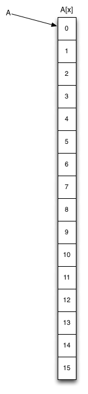
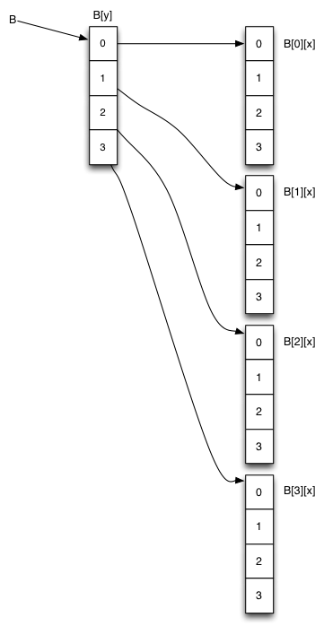
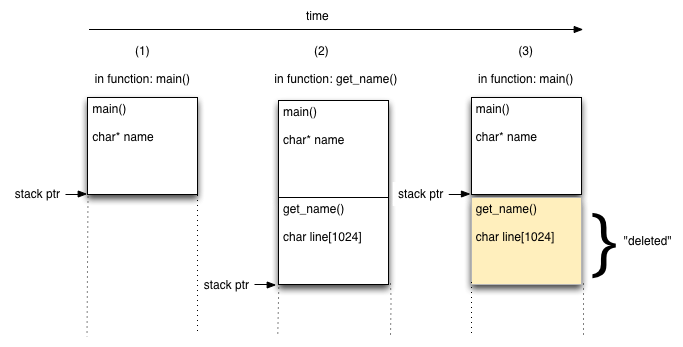
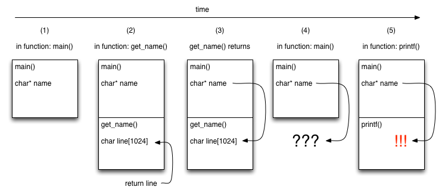

# Lab 03: 2D arrays and dynamic memory allocation

Download lab files [here](./files.zip).

Review "Guide"s and accompanying slides (we will go over these during the lab lecture).
- [Guide 01](#guide) ([slides]()): dynamic memory allocation

Try "Practice" problems on repl.it; these will NOT be graded.
- [Practice 01](#practice-01-fixing-the-bug-option-1)


# Multidimensional arrays

## Guide

Multi-dimensional arrays are arrays whose elements are pointers to other arrays.

Below, a series of 1D and multidimensional arrays are declared and used in the way you might guess by extrapolating from the 1D case:

```C
int A[4]; // 1D array of 4 elements
int B[4][4]; // 2D array of 4x4 elements

int C[3][3][4]; // 3D array of 3*3*4=28 ints (imagin a 3x3x4 cube)
int D[20][5][10][4]; // 4D array of 20*5*10*4=4000 ints

// sets every element in A
for (int a=0; a<4; a++) {
     A[a] = 99;
}

// sets every element in B
for (int y=0; y<4; y++) { // we assume the first array is rows (y axis)
    for (int x=0; x<4; x++) { // columns (x axis)
         B[y][x] = 99;
    }
}

C[0][0][0] = 99;
D[101][2][1][0] = 99;
```

`A` is of type array of int, `B` is of type array-of-array of int, etc.

Let's take a look at their memory layout.






You can see that there is some overhead in using the 2+D arrays; for example, in the 2D array case, we require more memory space and a two-step lookup to find the integer of interest.

For this course, we will be using row-oriented 2D arrays where the two index brackets `[][]` represents the row and the column respectively i.e. if we imaging our 2D array as a matrix, each element in the array of arrays points to an array that represents a row.

In practice, arrays of more than 3 dimensions are rarely used.


# Dynamic memory allocation

## Guide

Let's start by looking at the memory layout of a computer architecture.

The memory layout for a process varies a bit by CPU architecture and OS, but the scheme used by Linux on X86 is pretty typical, and shown below. The program's text (compiled code) and static data exist in low memory, the function call stack in high memory, growing downwards, and the "heap" storage space in between. Ignore the "memory mapping segment" for now.


Credit: this image is taken from an [excellent online description](http://duartes.org/gustavo/blog/post/anatomy-of-a-program-in-memory) of the memory layout of Linux by Gustavo Duarte.


### Stack storage: "automatic" variables

We have touched on "scope", let's look at it in more detail.

**Automatic variables** or local variables are varaibles used inside the body of a code block; this code block is almost always a function. Automatic variables are called automatic because their storage space is allocated for them automatically e.g. when a function is called.

C implements this very efficiently by allocating all the space for local variables in the stack frame for the function when the function is called (i.e. we get into scope).

When the function returns (i.e. we go out of scope), the stack pointer returns to its previous value, thus "freeing" all the local variables at small and near-constant cost.

Consider file `p0name.c`, it contains a common and nasty C bug:

```C
#include <stdio.h>

char* get_name(void) {
    printf("Please enter your name: ");

    // should be enough space for a name
    char line[1024];

    // reads at most 1023 chars from stdin, up to first newline, 
    // EOF or error.
    if (fgets(line, 1024, stdin) == 0) {// we ALWAYS check for I/O errors
        perror("failed to read a name");
        exit(1); 
    }

    // BUG: never return a pointer (e.g. line array)
    // created in the same body of code (e.g. char line[1024])!
    return line; 
}	

int main(void) {
    char* name = get_name(); // recall type* var initiates a pointer!
    printf("Your name is %s\n", name);
    return 0;
}
```

The image below shows a sketch of the function call stack for a run of this program up to and including the first line in `main`. 
- (1) When the program begins, the frame for `main()` is on the stack, and its local variables use stack memory for storage. The "stack pointer" keeps track of the current "top" of the stack (growing downwards). 
- (2)-(3) When `get_name()` returns, the stack pointer is placed to the end of calling function `main()`'s stack frame. The space used by `get_name()` will be reused by the next function call.




This mechanism is why:
- you must declare all your variables in C, the compiler has to decide how large a function's stack frame needs to be before the function runs;
- C programs can be very fast: memory allocation and deallocation, are very cheap for automatic variables.


The bug in `get_name()` is that the pointer returned by `get_name()` points to data inside that function's stack frame. When the function returns, that pointer is no longer valid. The illustration below explains what happens.
- (2) the return value of `get_name()` is determined to be the address of the `line` character string. 
- (3) `main()`'s name variable is set to the return value of `get_name()` and that function's stack frame is popped from the stack and thus forgotten. 
- (4) `name` points into the forgotten stack frame. This is a nasty bug, since the correct data _might_ still be there! 
- (5) the function call to `printf()` was entitled to overwrite the old data. There's a good chance that `name` now points to garbage.



This bug is one of the main reasons people complain about C. The code looks like it should work: the intent is clear; it compiles; it might even work in testing. Yet details of the implementation mean that the code is fatally bugged. This is undoubtedly a bad thing. The fact that it may work in testing is particularly awful.

The good news is that modern compilers will generate a helpful warning if you return a pointer to memory allocated for an automatic variable. 

**Try it yourself!**: Compile `p0name.c` and read its warnings; try to run the program and confirm it breaks as anticipated (you should get a warning: "function returns address of local variable"):
```
$ gcc p0.c -o p0name.o -Wall
```


## Practice 01: fixing the bug! (option 1)

The simpler, faster, and thus the best solution is to initialize (allocate) the array in the calling function and pass in a pointer to it; the function makes a copy of the pointer, uses it, and then throws away its copy of the pointer upon return --- without throwing away the actual array values in memory!

**REQUIREMENT**: debug `p0name.c`.

**TESTING**: you can test your program by running:
```
$ make p1
$ ./p1
```

<details>
<summary style="margin-left: 25px;">Try it yourself first; then verify your solutions here.</summary>
<div style="margin-left: 25px;">

See file [`p0parent.c`](./files/solution/p0parent.c). In this example, `get_name()` receives a pointer to array `name` which is stored inside `main()`'s stack frame. Since this is guaranteed to exist longer than the call to `get_name()` this will work correctly.


</div>
</details>

Note that the above solution still uses the stack. 

Recall: this means that the compiler has to decide how large a function's stack frame needs to be before the function runs; so it requires you to know how large of an array your function call will need at most, and to allocate that much memory in advance.

However, you won't always know how big of an array to expect. Also, if the amount of data you expect is usually very small, but might be very large at times, it would be wasteful to always allocate a huge array just in case.

#### Fixing the bug: option 2, explicit memory allocation on the heap

To overcome these shortcomings, we allocate memory explicitly, using `malloc()` (memory allocation) from the heap.

### Heap storage

About `malloc()`: 
- INPUT: the argument to `malloc()` is a size in bytes, so we almost always use `sizeof(/*some_type*/)` as a multiplier. 
- OUTPUT: `malloc()` returns a special type, a `void*` (pronounced "void pointer") to a memory allocation that will persist until explicitly de-allocated by a call to `free()` regardless of the state of the stack.

NOTE: most modern operating systems will recover all the allocated memory space after a program exits --- HOWEVER, it is good practice (and for the rare case, a necessary practice) to `free()` all the space you have `malloc()`-ed to the heap in your program so you know exactly when you take up how much space.

By default C allows a void pointer to be assigned to any other kind of pointer without having to be converted explicity. All pointers are just memory addresses, after all.

There is one more reason to use `malloc()`: the size of the stack is very limited. It is generally a few MB at most, and can be as small as a few KB on embedded systems. The stack has to be limited in size to avoid it growing into the heap and corrupting both segments (this is called "smashing the stack"). How large is too large for the stack? The answer is system-dependent, but anything over a few KB should probably go on the heap.

Using `malloc()`, you can and should allocate large things on the heap. If the heap is out of space, `malloc()` tells you so and you can either cope with it gracefully or quit your program. Automatic variables on the stack do not give you this opportunity. Once again, it is a downside of C that you must think about things like this. As usual, it's the price you pay for speed and control.

If you'd like to read similar material on memory management, presented differently, [here is a good write-up by Paul Gribble](https://gribblelab.org/CBootCamp/7_Memory_Stack_vs_Heap.html).

Here is a simple example on how to use `malloc()` and `free()`, omitting error checking for clarity:

```C
// choose a random array length
int len = 20;

// allocate memory for an array of len ints
//
// when you use malloc, you add a * in front of your data type
// 
// recall: type* initializes a pointer 
// pointing to a space in memory reserved for (len * int's)
// this pointer points to the first element in the array of len integers on the heap
// OR zero (null pointer) if the allocation failed
int* array = malloc(len * sizeof(int));

// (use the array)

// I am finished with the array
free(array);

// set my array pointer to NULL; 
// this way, if i accidentally use it again, 
// it will cause a segmentation fault (segfault) error
array = NULL; // or array = 0;
```

If you are not convinced this could be useful, take a read through `p0random.c`, compile it, and try running it.
```
$ make p0random
$ ./p0random
```
`p0random.c` contains a semi-realistic example with error checking included. Make sure you understand the code completely before you move on.

```C
#include <stdio.h> // for printf()
#include <stdlib.h> // for rand()
#include <time.h> // for time()

/* Reads an integer len from stdin and returns a pointer to an array
     of integers of length len, containing random values between 0 and
     len-1 inclusive. Sets *reportlen (which must not be null) to indicate
     the length of the array. */
int* get_random_number_of_random_numbers(int* reportlen) {
    // user enters a number for the array length AND maximum value    
    printf("Enter an integer: ");
    
    int len=0;
    if (scanf("%d", &len) != 1) { // always check I/O for errors
            perror("reading an integer failed");
            exit(1);
        }
    
    // explicitly allocate space for an array of ints
    int* arr = malloc(len * sizeof(int));
    
    if (arr == 0) {// always check a system call for errors
            perror("allocating a random-length array failed");
            exit(1);
        }
    
    // fill the array with random numbers
    for (int i=0; i<len; i++) {
        arr[i] = rand() % len;
    }
    
    *reportlen = len;
    return arr;
}	

int main(void) {
    // intialize the random number generator with the current time in seconds
    srand(time(0));
    
    // I can't know in advance how long array will be
    int len=0;			
    int* array = get_random_number_of_random_numbers(&len);			

    printf("[");
    for (int i=0; i<len; i++) {
        printf(" %d", array[i]);
    }
    printf(" ]\n");
    
    // de-allocate the memory allocated by malloc
    free(array);

    return 0;
}
```

# Building 2D arrays on the heap

The examples above show multi-dimensional arrays allocated on the stack. They can also be allocated manually on the heap. This example builds arrays `A` and `B` on the heap (omitting error checking) in C:

```C
int* A = malloc(16 * sizeof(int)); // 1D array

int** B = malloc(4 * sizeof(int*)); // 2D array
for (int i=0; i<4; i++) {
    B[i] = malloc(4 * sizeof(int));
}
```

This results in the same memory layout picture we saw before, except that all the arrays are in the heap: only pointers A and B are on the stack.

While this creation process is a bit laborious, accessing these arrays once created is simple and almost as fast as 1D arrays, so 2D arrays do get used quite a lot in practice.

When multi-dimensional arrays are built up manually in this way, you can cheaply reorder the higher dimensions of the array (e.g. B[y]) by swapping the pointers they contain, without touching the contents of the lower dimensions (e.g. B[*][x]). If the elements stored in the lowest dimension are numerous and/or large, this can make a big difference in performance.

# Moral of the story

Fixing bugs surrounding dynamic memory
- You CAN NOT return a POINTER that points to an address generated in the stack frame i.e. a local variable.
- You CAN return a POINTER that points to an address generated outside the stack frame.
- You CAN return a LOCAL VARIABLE VALUE (e.g. so far, a variable that is not an array).
- **Read your warnings!** Better still, always use `-Wall` and fix all warnings in your builds, every time.

Stack vs heap
- Stack storage
    - Pro: everything is automatic! space for automatic variables are automatically allocated and freed up after reaching the end of a code block!
    - Con: Being automatic also means that automatic variables are freed when you go out of scope, meaning it can't be accessed once we go out of scope.
    - Con: requires you to know how large of an array your function call will need at most, and it requires you to allocate that much memory in advance.
    - Con: there is limited space on a stack, generally a few MB, but anything more than a few KB should not go here; this is to avoid the stack from growing into the heap and corrupting both segments (this is called "smashing the stack").
    - Con: you don't know when a stack runs out of space, hence you can't cope with it gracefully or quit the program.
- Heap storage
    - Pro: there is lots of space here!
    - Pro: If the heap is out of space, `malloc()` tells you so and you can either cope with it gracefully or quit your program.
    - Pro: Unlike things on a stack, things stored in memory allocated on the heap is available to any function that knows its address, regardless of the current state of the stack.
    - Con: you have to manually allocate things on the heap using `malloc()`.


# Credit

Last updated 2021-05 by Alice Yue. 

Course material designed, developed, and initially taught by [Prof. Richard Vaughan](https://rtv.github.io/); this material has since been taught and adapted by Anne Lavergn, Victor Cheung, and others.
