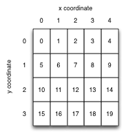

# Lab 03: Dynamic memory allocation

#### stack and heap, malloc() and free(), representing images

## Goals

After this lab you will be able to

1.  State the difference between heap and stack memory allocation.
2.  For any variable declaration, determine whether it will be allocated on the stack or the heap and why.
3.  Use malloc() and free() to manage heap memory.
4.  Use fixed-size integer types.
5.  Interpret integer arrays as images and operate on them.
6.  Write nested loops.

## Setup

In the terminal:

1.  Use the `cd` command to change directory (the `ls` command to list the content of a directory may be helpful as well) until you find yourself in your **local repo**.
2.  Download the [new material](3.zip) for Lab 3, stored in a compressed file called **3.zip**.
3.  Uncompress this file as follows:

    <pre>$ unzip 3.zip
    </pre>

    You should now see a directory called **3**.
4.  Once you have uncompressed **3.zip**, you can safely remove this compressed file with the `rm` command.
5.  Add this new directory **3** to your Git repository:

    <pre>$ git add 3
    </pre>

6.  Change directory into **3**, which will be our working directory for Lab 3.

## Demo Programs

In this lab, we will create, view and manipulate images using arrays as described below. Some of the code we have just downloaded make use of a windowing system (GUI) available on Linux called [X11](https://en.wikipedia.org/wiki/X_Window_System) in order to display these images on the screen.

Let's build two simple demonstration programs to illustrate how such images can be displayed on the screen.

To do so, we run a program called <tt>make</tt> at the command line. The [<tt>make</tt>](http://www.gnu.org/software/make/manual/make.html) program compiles many program files into an executable. It also automatically determines which, of the many programs, need to be recompiled, and issues the appropriate commands to recompile them. A description of how to build the program is provided in a _Makefile_. <tt>make</tt> is the standard tool for managing builds in the UNIX world. All IDEs such as Visual Studio, XCode and Eclipse have either <tt>make</tt> or a make-like tool under the hood. We will look at <tt>make</tt> in more detail later; for now we just run it with the supplied Makefile.

#### Demo Program <tt>text</tt>

1.  Run <tt>make</tt> in the current directory. The relatively complex compile command <tt>make</tt> runs is echoed on the screen:

    <pre>$ make

    gcc -std=c99 -g -Wall -O3 `pkg-config --cflags x11` -o test test.c imgops.c draw.c png.c -lm -lpng `pkg-config --libs x11` 
    </pre>

    If successful, the executable <tt>test</tt> will be built. If the build fails, look at the file <tt>Makefile</tt> to see some options for fixing it.

2.  Run the program <tt>test</tt>:

    <pre>$ ./test</pre>

    You should see a new window appearing with a completely black image. Click the mouse in the window to let the program continue and exit.

    Now run the demonstration program again, this time with a PNG image filename as an argument:

    <pre>$ ./test hadfield.png</pre>

    This time the window should contain an image of a moustachioed astronaut. Again, click the mouse in the window to let the program continue and exit.

3.  Read the program text of <tt>test.c</tt> that contains the program's <tt>main()</tt>. You don't need to understand the code in <tt>png.c</tt> or <tt>draw.c</tt>: just realize that the program in <tt>test.c</tt> is calling functions from these files to load an image from a file, and draw it in a window. As you might expect, <tt>test.c</tt> hash-includes header files <tt>png.h</tt> and <tt>draw.h</tt> which contain declarations of the functions defined in the corresponding C source files. If in doubt about this, look at the contents of the headers and C files in your editor.

#### Demo Program <tt>fractal</tt>

1.  A second example is also provided: a program that draws a Mandelbrot Set fractal. You can build it with this command:

    <pre>$ make fractal
    </pre>

2.  and run it like this:

    <pre>./fractal
    </pre>

3.  Read the implementation in <tt>fractal.c</tt> to see how memory is allocated to store an image, how it is interpreted as a two-dimensional array, and how the pixel colors are set by changing values stored in the array. The guide below explains this in detail.

There is no task associated with this fractal program. It is just a simple example to study.

# Guide

## Raster Images

In computer graphics, images are usually represented as arrays of <tt>pixels</tt> (picture elements). Each pixel describes the color of a single point in the image. For grey-level images - regular people call them "black and white" images - a range of 256 shades of grey, smoothly varying from 0 (black) to 255 (white) is enough to produce good-looking results.

We can conveniently and compactly represent a grey-level image as a one-dimensional array of unsigned chars of size (image_width * image_height). To interpret the array as a two dimensional image, we assume that each row of pixels is stored consecutively in the array. By convention, image coordinates have the origin in the top left, and y values increase downwards. We map image coordinates (x,y) to array indices thus:

<pre> index = x + y * image_width</pre>

The pixel indices of an image of width = 5, height = 4 are therefore:

A corresponding array declaration could be:

<pre class="prettyprint">unsigned int width = 5;
unsigned int height = 4;
unsigned char img[ width * height ];
</pre>

or, using the manual memory allocation described in detail below:

<pre class="prettyprint">unsigned int width = 5;
unsigned int height = 4;
unsigned char* img = malloc( width * height * sizeof(unsigned char) );
</pre>

Images represented this way are known as _raster_ images, from the latin _rastrum_ (a rake) from the days when images were drawn on the screen of a CRT monitor by steering an electron beam in the same line-by-line pattern. They are also called _bitmaps_ from the days when each pixel was only a single bit representing black and white.

For speed, C does not initialize the values of array elements for you. If you want an all-black image, you must set the pixels to zero:

<pre class="prettyprint">for( unsigned int i = 0; i < width*height; i++ )
  img[i] = 0;	      
</pre>

It can be faster to set all the pixels at once using the standard library function <tt>memset()</tt> instead:

<pre class="prettyprint">  memset( img, 0, width * height * sizeof(img[0]) );
</pre>

See the <tt>memset()</tt> manpage for details.

## Standard fixed-size integer types

Since the <tt>sizeof(int)</tt> varies with machine architecture, it is often useful to specify the size of your integer variables exactly. Then your code will use predictable variable sizes no matter which machine you run it on. The header file <tt>stdint.h</tt> defines a set of sized integer variable types for you, including:

<pre> int32_t   (32 bit signed int)
uint32_t   (32 bit unsigned int)
 int64_t   (64 bit signed int)
uint64_t   (64 bit unsigned int)
  int8_t   (8 bit signed int)
 uint8_t   (8 bit unsigned int)
</pre>

In this lab we will use <tt>uint8_t</tt> in place of its exact equivalent <tt>unsigned char</tt> for brevity. (It is C convention that the suffix <tt>_t</tt> denotes a type. )

## Reminder/primer: Computer architecture memory layout

The memory layout for a process varies a bit by CPU architecture and OS, but the scheme used by Linux on X86 is pretty typical, and shown below. The program's text (compiled code) and static data exist in low memory, the function call stack in high memory, growing downwards, and the "heap" storage space in between. Ignore the "memory mapping segment" for now.

[Image reproduced from an [excellent online description](http://duartes.org/gustavo/blog/post/anatomy-of-a-program-in-memory) of the memory layout of Linux by Gustavo Duarte.]

## Storage for "automatic" variables

In C terminology, a function's local variables are called "automatic variables" because the storage for them is allocated automatically when the function is called. Similarly, when the function returns, all that storage is automatically freed. C implements this very efficiently by allocating all the space for local variables in the stack frame for the function. When the function returns, the stack pointer returns to its previous value, thus "freeing" all the local variables at small and near-constant cost.

Consider this code, that contains a common and nasty C bug:

<pre class="prettyprint linenums">#include <stdio.h>

char* get_name( void )
{
  printf( "Please enter your name: " );

  // should be enough space for a name
  char line[1024];

  // reads at most 1023 chars from stdin, up to first newline, 
  // EOF or error.
  if( fgets( line, 1024, stdin ) == 0 ) // we ALWAYS check for I/O errors
  {
    perror( "failed to read a name" );
    exit(1); 
  }

  return line; 
}	

int main( void )
{
  char* name = get_name();

  printf( "Your name is %s\n", name );

  return 0;
}	       
</pre>

The image below shows a sketch of the function call stack for a run of this program up to and including line 23\. When the program begins (1), the frame for <tt>main()</tt> is on the stack, and its local variables use stack memory for storage. The "stack pointer" keeps track of the current "top" of the stack (growing downwards).

When <tt>get_name()</tt> returns (2)--(3), the stack pointer is simply replaced to the end of calling function <tt>main()</tt>'s stack frame. The space used by <tt>get_name()</tt> will be reused by the next function call.

This mechanism explains:

1.  why you must declare all your variables in C: the compiler has to decide how large a function's stack frame needs to be before the function runs;
2.  another reason why C programs can be very fast: memory allocation, and particularly deallocation, are very cheap for automatic variables.

#### Find the bug!

Test your understanding so far: can you find the bug in <tt>get_name()</tt>?

## Returning a pointer to an address in the stack frame!!!

The problem is the pointer returned by <tt>get_name()</tt> points to data inside that function's stack frame. When the function returns, that pointer is no longer valid. This sketch illustrates what happens:

At (2) the return value of <tt>get_name()</tt> is determined to be the address of the <tt>line</tt> character string. At (3) <tt>main()</tt>'s name variable is set to the return value of <tt>get_name()</tt> and that function's stack frame is popped from the stack and thus forgotten. At (4) <tt>name</tt> points into the forgotten stack frame. This is a nasty bug, since the correct data _might_ still be there! At (5) the function call to <tt>printf()</tt> was entitled to overwrite the old data. There's a good chance that <tt>name</tt> now points to garbage.

This kind of bug is one of the main reasons people complain about C. The code looks like it should work: the intent is clear; it compiles; it might even work in testing. Yet details of the implementation mean that the code is fatally bugged. This is undoubtedly a bad thing. The fact that it may work in testing is particularly awful.

The good news is that modern compilers will generate a helpful warning if you return a pointer to memory allocated for an automatic variable. <mark>Read your warnings. Better still, always use <tt>-Wall</tt> and fix all warnings in your builds, every time.</mark>

<mark>Bottom line: never return a pointer that points to an address in the stack frame.</mark>

#### Try it yourself

One of the source files you have downloaded for this lab, namely [get_name.c](get_name.c), contains the program above and demonstrates.

1.  Open this file in your text editor and have a read through it.

2.  Then compile it as follows:

    <pre>$ gcc -Wall get_name.c -o gn</pre>

3.  Read the warnings produced by the compiler and see if the compiler has spotted the bug.

4.  Try to run the program and confirm that it breaks as anticipated.

## First Solution: Allocate in caller

There are two different approaches to fixing this problem. The simpler and faster solution - and thus the best one when you can use it - is to have the calling function allocate the array and pass in a pointer to it, like so:

<pre class="prettyprint linenums">#include <stdio.h>
#include <stdlib.h>

void get_name( char line[], int maxlen )
{
  printf( "Please enter your name: " );

  // reads at most maxlen-1 chars from stdin, up to first newline, 
  // EOF or error.
  if( fgets( line, maxlen, stdin ) == 0 ) // we ALWAYS check for I/O errors
  {
    perror( "failed to read a name" );
    exit(1);
  }
}	

int main( void )
{
  char name[1024];
  get_name( name, 1024 );

  // we don't need to be lucky this time
  printf( "Your name is %s", name );

  return 0;
}	       
</pre>

This time <tt>get_name()</tt> receives a pointer to array <tt>name</tt> which is stored inside <tt>main()</tt>'s stack frame. Since this is guaranteed to exist longer than the call to <tt>get_name()</tt> this will work correctly.

#### Try it yourself

One of the source files you have downloaded for this lab, namely [get_name_parent.c](get_name_parent.c), contains the code above.

1.  Open this file in your text editor and have a read through it.

2.  Then compile it as follows, enabling all warnings to verify that the program builds without complaining about "function returns address of local variable":

    <pre>$ gcc -Wall get_name_parent.c -o gnp</pre>

3.  Run the program and confirm that it works correctly.

Satisfy yourself that you understand it before moving on.

## Second solution: Explicit memory allocation

The above method requires you to know how large an array your function call will need at most, and to allocate that much memory in advance. It is quite possible that you just don't know how much data to expect. Also, if the amount of data you expect is usually very small, but _could_ be very large, it would be wasteful to always allocate a huge array just in case.

In these cases, we must allocate memory explicitly, using the system call <tt>malloc()</tt>. This allocates memory on the heap, and returns a pointer to it. The allocation will persist until explicitly de-allocated by a call to <tt>free()</tt>. Because the allocation is on the heap, it is available to any function that knows its address, regardless of the current state of the stack.

Here is a simple example, omitting error checking for clarity:

<pre class="prettyprint">// choose a random array length
int len = rand();

// allocate memory for an array of len ints
int* array = malloc( len * sizeof(int) );

// array is now a pointer to an array of len integers on the heap
// OR zero (null pointer) if the allocation failed

// ...
// (use the array)
// ...

// I am definitely finished with the array
free( array );

// make sure to cause a segmentation fault (segfault) if I use 
// it again by mistake
array = NULL; // or array = 0;
</pre>

The argument to <tt>malloc()</tt> is a size in bytes, so we almost always use sizeof(some_type) as a multiplier. It returns a special type: a <tt>void*</tt> (pronounced "void pointer"). By default C allows a void pointer to be assigned to any other kind of pointer without having to be converted explicity. All pointers are just memory addresses, after all.

#### A more realistic example

Maybe you are not convinced that this could ever be useful.

One of the source files you have downloaded for this lab, namely [randomrandom.c](randomrandom.c), contains a semi-realistic example with error checking included.

1.  Open this file in your text editor and have a read through it.

2.  Then compile it as follows:

    <pre>$ gcc -Wall randomrandom.c -o rr</pre>

3.  Run the program and confirm that it works as expected.

Make sure you understand the code completely before you move on.

## Limited stack size

There is one more reason to use <tt>malloc()</tt>: the size of the stack is very limited. The exact size depends on your OS, CPU architecture, and current configuration, but is generally a few MB at most, and can be as small as a few KB on embedded systems. The stack has to be limited in size to avoid it growing into the heap and corrupting both segments (called "smashing the stack"). You should allocate large things on the heap with <tt>malloc()</tt> instead. If the heap is out of space, <tt>malloc()</tt> tells you so and you can either cope with it gracefully or quit your program. Automatic variables on the stack do not give you this opportunity.

Once again, it is a downside of C that you must think about things like this. As usual, it's the price you pay for speed and control.

#### How large is too large for the stack?

The answer is system-dependent, but anything over a few KB should probably go on the heap.

## Say that again?

If you'd like to read similar material on memory management, presented differently, [here is a good write-up by Paul Gribble](https://gribblelab.org/CBootCamp/7_Memory_Stack_vs_Heap.html).

# Requirements

The task structure in this lab is different to your previous labs.

1.  Your job, in this lab, is to finish the implementation of several function definitions in the supplied file <tt>imgops.c</tt>. The grading robot will exercise these functions to see if they meet the requirements (specifications).

2.  Read the documentation in <tt>imgops.c</tt> or in <tt>imgops.h</tt>. This documentation describes what each function does and the requirements you must satisfy when implementation each function.

3.  Implement and compile a task at a time.

4.  To test the function(s) of a task, extend the program in <tt>test.c</tt> so that it calls each of your function(s) and displays the resulting image in its own window.

    How to do this will be demonstrated at the beginning of the lab session.

    Writing tests is part of the work of a programmer, so get used to testing as you go.

5.  Once you have implemented, compiled and tested a task in <tt>imgops.c</tt>, you can add, commit and push this file to your Git repo and move on to the next task.

The grading robot will grade the pushed file, reporting on the task you have implemented and will mark the other yet-to-be implemented tasks as unsuccessful (red boxes). Repeat the above steps until all your tasks have successfully been tested (green boxes).

Important: DO NOT add a <tt>main()</tt> function in <tt>imgops.c</tt>. Keep it in <tt>test.c</tt>. This is because the grading robot has its own test driver program with a <tt>main()</tt> function. An extra <tt>main()</tt> will prevent the grading robot's test program from compiling.

Also important: DO NOT make your <tt>imgops.c</tt> code rely on any other files. For testing, the grading robot copies only your <tt>imgops.c</tt> and will not bring any of your other files along.

* * *

Lab 3 completed. [Back to the course web page](../../).
