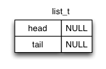

# Lab 07: testing and linked lists

Download lab files [here](./files.zip).

Linked lists have been described in CMPT 125, but it doesn't hurt to see them again.

Review "Guide"s and accompanying slides (we will go over these during the lab lecture).

| 2021-07-27 |
|----|
| <a href="http://www.youtube.com/watch?feature=player_embedded&v=LB3-cP8yevQ" target="_blank"></a> |

- [Guide 01](#guide) ([slides](https://docs.google.com/presentation/d/1vnvehN4mntZ2GOt0aA_seKMoLQxhZ9HcNeEPOD2gdGU/edit?usp=sharing)): linked lists

Try "Practice" problems; these will NOT be graded. Note that the solutions given for Practices is just one of many possible solutions, better ones may exist.
- [Practice 01](#practice-01)
- [Practice 02](#practice-02)

# Drawing - a tool for thinking

Drawing diagrams is very helpful before writing code that modifies lists. In general, sketching machines - including code - is a tool for thinking; even if you think you know what you are doing, drawing out the operations is a concrete test of your understanding. Even very experienced people with great intuition use drawings for thinking.

# Linked lists

## Guide

**Linked lists** are data structures that contain a sequence of data elements, like arrays, but with different dynamic properties. The key idea in the linked list is to use a simple data structure to store each data element along with a pointer to the next element in the list. The end of the list is denoted by a `NULL` pointer.

Our implementation uses a second data structure called a **header** to store pointers to the first (head) and last (tail) elements in the list.

The list is assembled as follows:

- First a `list_t` structure is allocated on the heap, with its head- and tail-pointers set to NULL, representing an empty list.



- To insert the first value into the list, a new `element_t` is allocated on the heap, the value is stored in it, and the header's head- and tail-pointers are both set to point to it. The first element's next-pointer is `NULL` to indicate it is the last element in the list.


- When a subsequent element is added, the next-pointer of the tail element and the tail-pointer of the header are both changed to the address of the new element:


- One more addition using the same mechanism. Notice that the tail element always has its next-pointer set to `NULL`.


- To remove the head element, you just have to do the opposite of insertion: free the head pointer, and redirect the head pointer to the second element. Assuming that your list is called `list`, see an example below for removing an element:

```C
element_t* curr = list->head;
element_t* next = curr->next;
free(curr);
list->head = next;
```


**double-linked list** is a common variant of the regular linked list in which every element contains a previous-pointer in addition to the next-pointer. Double-linked lists can be traversed forwards and backwards, at the cost of a little more storage space per element.

### Arrays vs linked lists: runtime

| Task                             | Arrays                | Double-/linked lists |
|----------------------------------|-----------------------|----------------------|
| Insert an element                | O(n) (preallocaiton: Θ(1)) | **O(1)**        |
| Access an element based on index | **O(1)**              | O(n)                 |
| Remove an element                | O(1) (O(n) if stable) | O(1)                 |

The `std::vector` in C++ is the same as an array except it can automatically change in size i.e. it has implemented preallocation Θ(1) for you so you don't have to (see [push-back](https://www.cplusplus.com/vector::push_back)). But remember, there are also other implementations of vectors in C++, so don't assume thaat preallocation is the default implementation.

List elements are therefore best accessed in order, since accessing the next element takes constant time.

Arrays and vectors are therefore, the most efficient data structure(s).

## Practice 01

**DESCRIPTION**:
- `p1list.h` contains an interface specification for a linked-list-of-integers data structure. Notice that instead of just defining `element_t` by writing `typedef struct {...} element_t;`, we write `typedef struct element {...} element_t;`. Adding `element` in here provides us a **structure tag** that we can use within our structure type before completing our type definition. We call it a "tag" and not a "name" because the "name" of this structure would be `struct element` not just `element` alone --- this is jargon.
- 5 slightly different implementations are provided, in files `p1.N.c` where N = [1,...,5].
- `p1.c` contains a very weak test program for the linked list code.

`Makefile` will build programs `p1.1` through `p1.5`, each linking the same `main.c` with one of the list implementation C files. Build each program by naming it as your 'make' target, e.g. the above two make commands will each create an executable 'p1.1' and 'p1.5'.

```
$ make p1.1
$ ./p1.1

$ make p1.5
$ ./p1.5
```

You can also build all programs by using the following command:

```
$ make all
```

Running the resulting programs, you will see that every one passes the test in `p1.c`... but in fact, all of these implementations contain bugs.

**REQUIREMENT**: your task is to extend `p1.c` to thoroughly test the list implementations. Your program must reliably distinguish all these faulty implementations from a correct one.
- Your `p1.c` will be compiled with each of `p1.N.c` as well as a bug-free version (not supplied to you).
- OUTPUT: 
    - A program built from your `p1.c` and linked against any implementation of the functions in `list.h` must return 0 if the functions are bug-free, or 1 if they contain one or more bugs.
    - Remember: returning `1` means an error has occured during the execution of your program while returning 0 means that your program successfully executed.
- BEHAVIOUR:
    - Preferably, your program should not crash or halt on `assert()`. But a crash (e.g. segmentation fault) or assertion will be recorded as indicating the code contained bugs.
    - Preferably, print an explanatory error message on stdout describing the problem you discovered.
    - You may produce (a sensible amount) of other text output on stdout or stderr. Try to make the text output helpful for yourself or an instructor/TA/peer-tutor helping you.

Try it yourself first; then verify your solution with the solution to the next practice problem :).


## Practice 02

**REQUIREMENT**: you will implmenet the correct version of all the functions described in `p1list.h` to file `p2list.c`.
- You may use any piece(s) of the supplied code, or write your own.
- Your code should pass all your tests i.e. the `p1.c` you extended.

**TESTING**: you can test your program by running:
```
$ make p2list
$ ./p2list
```

Try it yourself first; then verify your solutions [here](./files/solution/p2list.c).

## Practice 03

Try it yourself!

**REQUIREMENT**: declare and define a function in `p1list.h` and `p2list.c` respectively. Your function should take a pointer to a list `list_t* list` as input and return `void`. Your function should remove the second element from the given list. You may assume the given list has 3 or more elements and that it is well-formed.

# Credit

Last updated 2021-05 by Alice Yue. 

This document was designed, developed, and originally by [Richard Vaughan](https://rtv.github.io/); this document has since been taught and adapted by Anne Lavergne, Victor Cheung, and others.
