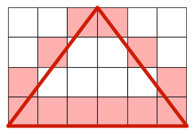

# Lab 01: Getting started in C

Open assignment 1 on repl.it: ***

Open today's lab lecture: 


## Goals

After this lab you will be able to

1.  Follow the instructions for subsequent labs.
2.  Compile and run a C program from the command line in Linux.
3.  Submit code for evaluation on `Repl.it`.
4.  Create and use variables of the native types and obtain their addresses.
5.  Perform basic input and output on the console.
6.  Link to the standard math library
7.  Write loops using the `while` and `for` syntax.
8.  Write conditionals using the `if` syntax.
9.  Obtain the evaluation results through the version control system.


## [Introduction](#intro): basic C syntax and compilation workflow

You will complete lab tasks and exercises, and submit them as a part of your assignment; to be done individually.

In this course you will learn to code in C.

C was created by [Dennis Ritchie](https://en.wikipedia.org/wiki/Dennis_Ritchie). [Brian Kernighan](https://en.wikipedia.org/wiki/Brian_Kernighan) wrote the first C tutorial. The first edition of this book written by them (called K&R for short) was published in 1978.

### [Setup](#setup)


*** repl.it + canvas


### C program syntax

The following C or C++ program prints a greeting to the [standard output (stdout)](http://www.linfo.org/standard_output.html), a text stream that your command-line-based program (shell) uses to output text to the screen (or other places we will see later).

```C
// author: <YOUR SFU USER ID HERE>
// date: 2021-05-18
// input: void
// output: void
// description: prints a greeting to standard output.

#include <stdio.h>

int main(void) {
  printf("Hello World\n");
  return 0;
}
```

C syntax

- `//` starts a line of comments; comments are text not processed by the computer and are there for documentation purposes only.
- `#include <stdio.h>` copies the contents of `stdio.h` directly into the program code. Below the `#include` line we can call any functions declared in the included file, including `printf`. Before we use `printf`, we need to tell the compiler where to find it so we import a declaration of its name and the arguments it accepts. This is provided with your compiler installation in the file `stdio.h`. The compiler is set up so that it knows where to look for it. It's often in the `/usr/include` directory on Linux.
- `int main(void)` defines a function called `main` that returns an integer (`int`) and takes no arguments (`void`). C programs always start running at the `main` function. It's a bit more complicated in C++, but in both languages every program contains exactly one `main`, which is called by the operating system when the program starts. If you forget to define `main`, the compiler will report an error because it does not know where to start the program execution. The body of the function is contained within curly braces `{ ... }`. Unlike Python, the C compiler ignores indentation and newlines completely: they are only used to lay out the code for humans to read. Spaces, tabs and newlines do nothing except separate the tokens - the linguistic atoms - of the language.
- `printf` is a C function from `stdio.h` that composes a chunk of text and sends it to standard output (stdout). As in many other languages, C strings are a sequence of characters contained within double-quote characters `"like this"`. We will come back to the details of C strings later. 
- `\n` is an **escape sequence** that represents the newline character. This is different from a `print` statement in Python that automatically ends the line for you: the C function `printf` does not. To have a newline in output, we have to represent it with this special escape sequence.
- Statements end with a semicolon `;`. This is different from Python which uses newlines to end statements.
- `return 0;` causes the `main` function to return the integer value `0` (zero) as the result of the function. Back on `int main(void)`, we promised that the main function would return an integer, and the compiler would warn us if we forgot to do so. Since this is the `main` function, the caller is the command shell which invoked (ran) the program, which receives the value zero as the program's result. C programs always return an integer, and programmers conventionally use this value to indicate that the program was successful by returning zero, or a non-zero error code if something went wrong. We return zero to indicate that we detected no problems.


### Compiling the C program

Go to your **shell**.

Follow these steps to compile and test your program. Remember, "test your program" means: run it, read its output and make sure they match the expected output.

1.  Type in the code from the box above into a new file and save it as `t1.c`. C files conventionally have a .c suffix.
2.  Compile the source code file `t1.c` to create a binary executable file that can be run from the shell:

```bash
gcc t1.c
``` 
    
3.  If the program compiled correctly, the compiler created a new file in the current directory called `a.out` containing your executable program. Instead if you get error messages read them carefully, top to bottom and edit the code to fix the first reported error, then compile again. Once all looks well, run your program using its name like so:

```bash
./a.out
``` 
    
(where "./" means "this directory"). You should see the expected output on your console:

```bash
Hello World
```

4.  Specify a more descriptive name for your program than the default `a.out` with the compiler output name option `-o`:

```bash
gcc -o t1.o t1.c
./t1.o
Hello World
```
    
7.  You now have a working program written in C and built with your bare hands using only the command line. Not bad.

For more details on compiling code, [click here](compiler)


## FOR ALL ASSIGNMENTS: Designing, Testing, and debugging programs

All programs you will design can be seen as a black box that have 
- some **input** (e.g. no input `void`), 
- some **output** (e.g. integer output `0`), and 
- some **behaviour** (e.g. print out a greeting `Hello World`).

Always think about what your program does in terms of input, output, behaviour!

Testing is extremely important, and beginners often underestimate how much time and effort is required for good testing. In this case the test is easy and can be done by a human directly. Does the output text match exactly the required text? Will be discussed 

**Test drivers** are automated scripts (also referred to as unit tests) that test to see if your program requirements are met by trying a variety of test cases and checking for the expected output (expected results). You should write test drivers to make sure your code is correct before submission in all but the most trivial programs.


### [Assignment 1, task 1](#task1)

HINT: Try this before you start, what does it output?

```C
// author: <YOUR SFU USER ID HERE>
// date: 2021-05-18
// input: void
// output: int
// description: prints a greeting to standard output.

#include <stdio.h>

int main(void) {
  printf("Hello World\n");
  printf("My name is Alice\n");
  return 0;
}
```

REQUIREMENT: Write a C program `t1.c` that writes the string `Hello World!`, `My name is <your name>.`, and `Nice to meat you!` in 3 separate lines to standard output.

REMEMBER: always write comments!!

BEFORE YOU SUBMIT: test and debug your code!
1.  Fix the error in code in `t1.c` by adding the missing exclamation point.
2.  Compile and run it, and verify that it now produces the correct output (expected result).
3.  Now your program meets the requirements and you are ready to submit it.

  

## Variables

A variable is made up of 3 things: 
- a **variable name**, a name given to the variable by you, 
- a **value**, the value assigned to the variable (this is what functions take as argument by default!!), and 
- a **pointer** or an address indicating where in memory the variable's value is stored (we get this by prepending a `&` to the variable).

A variable in C is created by the `=` operator:

```C
int i = 0;
```

`int` (data type) `i` (variable name) `=` operator that initializes the variable and assigns it a `0` value; `i`'s pointer can be accessed with `&i`.

### Value types and printf

C is a _strongly typed_ language. This means:
- all variables have a static _type_ that identifies the kind of data they store; a variable's type cannot change.
- every variable has a _value_ which is the data it stores; a variable's value may change

Advantages to being _strongly typed_:
- Explicit statement of intent. You tell the compiler and people reading the code what kind of data you are manipulating.
- Error prevention at compile time. If you violate your stated intent, the compiler lets you know right away.

C has several native (i.e. predefined) variable types. They differ by the kind of value they store and by the range of possible values. Here are the most commonly used variable types in C:

**floating-point types**

| Type specifiers | Precision (decimal digits) | Exponent range |
| --------------- | -------------------------- | ---------------|
| `float`         | 6                          | ±38 (8 bits)    |
| `double`        | 10                         | ±307 (11 bits)  |

**integer types**

| Type specifier   | Minimum value   | Maximum value |
| ---------------  | --------------- | ------------- |
| `char`           | \-127           | 127           |
| `int`            | \-32,767        | 32,767        |

A **characters** `char` uses 7 bits (bits = either 0 or 1) so it can represent 2^7 or 128 possible values. Hence, each character is represented by a unique set of numbers, see [ASCII](https://en.wikipedia.org/wiki/ASCII).

A **string** in C is an array of characters (or an array of characters) terminated by a zero value.

Integer and floating point types represent numbers exactly over a limited range and approximately based on the number of bits respectively. [A complete list of the native types is available at Wikipedia](http://en.wikipedia.org/wiki/C_syntax#Primitive_data_types).

```C
char coursename[] = "CMPT 127"; // 'C', 'M', 'P', 'T', ' ', '1', '2', '7', '\0'
coursename[0] = 'C'
```

#### `printf`

`printf` allows you to print all the native variable types. Using `printf` is similar to using the `%` idiom in Python's `print` function. `printf` is less flexible about its input than Python's `print`, but you can do a lot with it. For floating point numbers, you can specifiy the precision at which the number is printed by adding `.2` with `2` being the number of decimal points ot print to `%f` \> `%.2f`.


```
int i = 0; // integer
float pi = 3.14159; // floating point number
char c = '+'; // character
char coursename[] = "CMPT 127"; // string = array of characters

printf( "Here: %d %.2f %c %s \n", i, pi, c, coursename);
```
Which produces this on stdout

```bash
here: 0 3.14 + CMPT 127
```

#### Arithmetic expressions

An expression in C is a sequence of variables, operators and function calls. The following are valid simple expressions.

```C
a
a+b // addition
a*(b+c) // multiplication
a*sqrt(b) // square root
a/b
```

The result of any given expression is always a value with a type. This means that an expression can be used anywhere a value is expected, such as following the format string in a call to printf. For example, the following is valid

```C
int a=2;
int b=10;
     
printf( "the product of a and b equals %d\n", a*b );
```

### Pointers

The **pointer** of a variable is the address to where things are stored in memory. Each byte of memory has a unique numeric address, numbered from 0 to the size of the space. For example, if your memory is 4GB, it has around 2^64 or 4.3 billion bytes. Every address contains a single value from 0 to 2^8 (255).

REMINDER: a bit is a 0 or 1, a byte is 8 bits.

When you declare a variable, e.g. `char c = 42;`, the compiler chooses an unused address to contain it, e.g.`4`, then writes the initial value `42` into the memory at that address i.e. `c`'s
- variable name is `c`,
- value is `42`, and
- pointer address is `4`.

If your value is larger than 2^8, the compiler allocates a sequence of addresses and gives the variable the lowest-numbered address of this sequence.

Python and many other 'high level' languages have different storage models and you rarely have to think about them. That's part of what 'high level' means. C allows/requires you to think about data storage more directly. Many languages, e.g., Java, do not allow you to use pointers, and have _references_ instead. These are implemented internally as pointers, with an extra little safety net limiting how you use them. C has only pointers, for simplicity. C++ has both pointers and references.


### Reading user input with `scanf`

Now let's look at a C program that inputs an integer from the user and echoes it back

```C
#include <stdio.h>

int main(void) {
  int i = 0; // 0 is just a placeholder value

  printf("Enter an integer: ");

  scanf( "%d", &i ); // scanf(<"type of input">, <the memory address, i.e. pointer, where scanf should put the input value into>)
  printf( "Your integer was: %d\\n", i );

  return 0;
}
```

- `scanf` is roughly the inverse of `printf`; it reads text from _standard input_ `stdin` and assigns it to a variable.
  - argument 1 type string e.g. `%d`: this is the format string argument that tells `scanf` that it should interpret the user input as a decimal integer. Whitespace is ignored.
  - argument 2 address in memory where it will store user input e.g. `&i`: arguments to functions are _passed by value_ (recall, `printf` has always printed the _value_ of our variables); however, if we give `scanf` `i`, it will see `0` which isn't an address in memory! So we prepend `i` with a `&` to get `i`'s pointer, the address in memory where we are currently storing `0`, and tell `scanf` to replace this value of `i` with the user input.

If we do omit the `&` before the argument `i` we get an error message.
```C
int i = 0;
scanf( "%d", i ); // ERROR!
```


### Assignment 1, task 2: scan and print

HINT: try this program before you start, what does it output?

```C
// author: <YOUR SFU USER ID HERE>
// date: 2021-05-18
// input: void
// output: int
// description: takes user input from console and prints a message.

#include <stdio.h>

int main(void) {
  float i = 0.0;
  float j = 1.0;
  float k = 2.0;
  
  printf("give me an integer: \n");
  scanf("%f", &i);
  
  printf("the value of i is %.2f, its pointer points to address in memory %p\n", i, &i);
  printf("the value of j is %.1f, its pointer points to address in memory %p\n", j, &j);
  printf("the value of k is %.0f, its pointer points to address in memory %p\n", k, &k);
  
  return 0;
}
```

1.  Write a new C program in the file `t2.c`.
2.  Write a program to `scanf` two integer values from standard input, then `printf` their sum.
3.  Remember to consider negative numbers (which are also valid integers).
4.  Be careful about whitespace at the start or end of each line in your output.
5.  Remember to prompt the user for what they should enter by printing messages with `printf`, e.g. `"Enter an integer: "`, and let the user know what the output is by printing a message, e.g. `"Here is the sum: "`.


## Conditions: if/else

Humans often use decision trees to determine the right course of action. Decision trees can be framed as an if/else statement. For example, if it is raining outside, I will wear a rain coat, else I won't.

To embed decision making and condition handling in software, we use the `if`/`else` statements

C's basic conditional is `if` and it has the form:

```C
if (<statement>) {
    // this block is executed if and only if <statement> evaluates to true (non zero)
} 
```
    

For example:

```C
int s = 96;
int highscore = 95;

if (s > highscore) {
    highscore = s;
    printf( "Congratulations on a new high score!\n" );
}
```

An optional `else if` and `else` block can be added that will run only if the condition is false. Thus you can choose between two courses of action, for example:

```C
int s = 96;
int highscore = 95;

if (s > highscore) {
    highscore = s;
    printf( "Congratulations on a new high score!\n" );
} else if (s == highscore) {
    printf("Ok!\n");
} else {
    printf( "Bad luck. Try again\n" );
}
```

### Infix operators

`>` and `==` are examples of _infix_ comparison operators and can be put between variables to evaluate their relationship with each other.

These comparisons are statements that give our `if`/`else if`/`else` statements a _Boolean_ value: true (non-0), false (0)

| name                     | syntax |
| ------------------------ | ------ |
| equal to                 | \==    |
| not equal to             | !=     |
| less than                | <      |
| greater than             | \>     |
| less than or equal to    | <=     |
| greater than or equal to | \>=    |
| not                      | !      |

Notice the _equal to_ operator "==" is distinct from the assignment operator "=" . Mixing these up is a common bug for C beginners. Double-check every time you intend to use "==".


## Loops

Remember that task 2 only works with two numbers. Let's extend it to handle any numer of inputs. For this we need to repeat part of our program to deal with each value that comes. We need a _conditional loop_. C has only two options: while and for.

  

### While loops

The while keyword has the following form:

```C
while (<condition>) {
    // this block executes repeatedly as long as condition evaluates to true
}
 ```   


For example this code

```
int i\=0; 
while (i < 6) { 
    printf( "%d ", i ); 
    i++; // ++ is an increment operator that is a shorthand for i = i + 1
    // i-- is a decrement operator that is a shorthand for i = i - 1
}
printf( "\\n" );
```

and (almost) equivalently

```C
int i=0; 
while (!(i == 6)) { 
    printf( "%d ", i ); 
    i++; 
} 
printf( "\\n" );
```

produces the output

```bash
0 1 2 3 4 5
```

The repeating block of code is contained in curly braces `{ ... }` the same as with the conditional structure we saw earlier.

Note that if the while condition is false on the first evaluation, the body of the loop is never executed; to ensure that at least one execution of the loop is done, we can alternatively use `do`/`while`:

do  {
    // this block executes at least once, 
    // then repeats as long as
    // condition evaluates true
} while (<condition>);
    
For example this code

int i=0; 
do { 
    i = getNextValueFromDatabase(); 
} while (i <= 1000)

will get at least one value from the database, and will repeat this until it fetches a number bigger than 1000.

DANGER: if all the values in the database are less than 1000, this program will happily run forever D:!


### For loops

The pattern above, where we initialize a variable, test its value, then perform a loop that changes the value, is so frequently used that it has a special syntax: the _for loop_, which has the form

for(initialize; condition; modify) {
    // this code runs until condition evaluates to false 
}
    
Any valid C expression can be used in each of the three for() components, separated by semicolons. But they are usually quite simple. For example:
```C
for (i=0; i<6; i++) { 
    printf( "%d ", i );
} 
printf( "\\n" );
```
is functionally identical to our first while example.

Every for loop has an equivalent while, and _vice versa_, so choose whichever is neatest for the loop at hand.


### Break

You can break out of a loop body with the break; statement. For example, this code:
```C
#include <stdio.h>
#include <stdlib.h>

for (i=0; i<1000; i++) { 
    if (random() % 100 == 0) { // random() is defined in stdlib.h 
        break; 
    }
    printf("%d ", i++); // prints the value and THEN increments it
}
```
will print integers in sequence from 0, but has a 1% chance of leaving the loop every time around. The function random() returns a random integer and the % operator is the integer modulus operator, so the code will print consecutive numbers up to 999 or until random() returns a multiple of 100, whichever comes sooner.

  

### Continue

You can jump to the beginning of a loop body with the continue; statement. For example, this code:
```C
for (i=0; i<1000; i++) {
    if (random() % 100 == 0) {
        continue;
    }
    printf( "%d ", i++ ); // prints the value and THEN increments it 
}
```
will print integers of increasing value, but every loop iteration has has a 1% chance of jumping to the beginning of the loop without printing. Thus this code will continue to loop until it reaches 1000, but might skip a few numbers.


### Assignment 1, task 3

Can you write your programs without using _break_ or _continue_?

  


#### Requirements

It is very IMPORTANT that you read ALL the requirements for this Task 5 before you start writing your program. Pay particular attention to the **Important Note** below describing the input and output being interleaved on the monitor screen.

1.  Save your program to the file `t5.c`.
2.  Write a program to read any number of floating point values from standard input, separated by newlines.
3.  The input may also contain any number of blank lines, i.e. lines that contain any amount of whitespace followed by a newline.
4.  With the exception of blank lines, the input is guaranteed to be well-formed and contain at least one valid floating point value. Therefore, there is no need for our t5.c program to print a helpful error message (as we did in Task 4 when the input was not well formed).
5.  For each value input, output (as before):
    1.  The largest integer smaller than this value;
    2.  The nearest integer to this value, with halfway values rounded away from zero;
    3.  The smallest integer larger than this value
6.  For each input value, the output integers should be separated by a space character and followed by a newline character.
7.  The output values should not have any trailing zeros: e.g., "2" not "2.0".
8.  If no floating point value can be parsed (i.e. a blank line was read) there should be no output. To put it another way: blank lines should be ignored.
9.  The program should accept input values on stdin until EOF is reached.
10.  When EOF is reached, print `Done.\n` on line by itself, then exit the program. This line has a `.` at the end of it. Pay attention to small details.
11.  Sample input:
    
        3.1415
        7.11
        -15.7
        
    
12.  Corresponding output:
    
        3 3 4
        7 7 8
        -16 -16 -15
        Done.
        
    

**Important Note:** Your input and output are interleaved in the terminal window, so if you type in the numbers and press enter after each line then the _appearance_ of a run of a correct program with the input above is:

    3.1415
    3 3 4
    7.11
    7 7 8
    -15.7
    -16 -16 -15
    

It's important to realize that the above output consists of alterating line of input and output, each three lines long.

If you construct the input and feed it using shell commands you will see only the output of your program

    gcc -o t5 t5.c -lm
    echo "3.1415 7.11 -15.7" | tr ' ' '\n' | ./t5
    

The `-lm` suffix means link (`-l`) the math library (`m`). The link command comes after the name of the source file(s), so that the compiler knows which functions are needed from the library.

Then the output will be

    3 3 4
    7 7 8
    -16 -16 -15
    Done.
    

  

#### Guide

Try to write code that is readable. Make the code self-explanatory to someone else who might read your program and try to use it.

  

#### Testing coverage

Don't forget to test yourself interactively on a variety of inputs. One is not enough. Your job is to find bugs before our grading system does. Think "what can I possibly do to make it go wrong?".

As always, make sure your program meets the requirements. Here is a key idea: **perform a test that covers every requirement**, including those about malformed input and empty lines. Your tests should also exercise every line of your program, including every possible branch due to a conditional. This is the principle of _coverage_. We will talk more about testing strategies later.

It's also important to understand that **a program that passes all the tests may not be correct**. While our online tests aim to cover a variety of input cases, we don't know what's in your program, so we can not guarantee code coverage.

Only you can ensure your code is correct!

#### [Task 6: Simple statistics](#task6)

  

#### Introduction

An exercise in computing elementary statistics over a set of input values. You will need to loop over a `scanf` and check its return value to detect the end of the input.

#### Requirements

1.  Save your program to the file `t6.c`.
2.  Read floating point values from stdin, each separated by a newline, and terminated by EOF.
3.  The input values are in the range \[-100,000 to +100,000\].
4.  The input will contain at least one floating-point value.
5.  The input may contain blank lines: these should be ignored.
6.  Apart from possible blank lines, the input is otherwise well-formed.
7.  At EOF, output:
    1.  The smallest value seen.
    2.  The largest value seen.
    3.  The arithmetic mean of all the values seen.
8.  All output must be accurate to two decimal places.
9.  The output values must be separated by a single space character and followed by a newline character.
10.  Examples:
    1.  *   Input:
            
                7
                5.6
                6
                
            
        *   Output:
            
                5.60 7.00 6.20
                
            
    2.  *   Input:
            
                11
                
            
        *   Output:
            
                11.00 11.00 11.00
                
            

  

#### Guide

Note that you do not have handle arbitrary text in the input. Only well-formed numbers and empty lines.

The [definition of the arithmetic mean](http://en.wikipedia.org/wiki/Arithmetic_mean).

#### [Task 7: Horizontal graph](#task7)

  

#### Introduction

Write an easy but useful graphing program.

#### Requirements

It is very IMPORTANT that you read ALL the requirements and the examples for this Task 7 before you start writing your program. Pay particular attention to the **Important Note**'s below describing the input and output being interleaved on the monitor screen.

1.  Save your program to the file `t7.c`.
2.  Read an arbitrary number of positive integer values from stdin. The values are separated by one or more spaces or by newlines (only - no other characters must separate them).
3.  The input is guaranteed to be well-formed.
4.  On standard output, render a simple graph representation of the input values, in order, using hash `#` characters as shown in the examples below. The number of hashes printed should be equal to the input value.
5.  Your program should output exactly one line per input value.
6.  The value zero should generate an empty line, i.e. just a newline character.
7.  Ignore empty lines. Do not output a newline for an empty line.

  

#### Examples

Input

    5 4 3 2 1
    

Output

    #####
    ####
    ###
    ##
    #
    

**Important Note:** For this example, the output is displayed after you have typed the input in the terminal window, so the appearance of the run of a correct program with the example above is:

    5 4 3 2 1
    #####
    ####
    ###
    ##
    #
    

Input

    16
    0
    4
    12
    

Output

    ################
    
    ####
    ############
    

**Important Note:** Your input and output are interleaved in the terminal window, so the appearance of the run of a correct program with the example above is:

    16
    ################
    0
    
    4
    ####
    12
    ############
    

Input

    1 1 3 
    2 1
    

Output

    #
    #
    ###
    ##
    #
    

**Important Note:** Your input and output are interleaved in the terminal window, so the appearance of the run of a correct program with the example above is:

    1 1 3 
    #
    #
    ###
    2 1
    ##
    #
    

Input

    3
    
    
    2
    1
    

Output

    ###
    ##
    #
    

**Important Note:** Your input and output are interleaved in the terminal window, so the appearance of the run of a correct program with the example above is:

    3 
    ###
    
    
    2
    ##
    1
    #
    

In the next lab we will see how to use files with stdin and stdout to avoid this unsightly mess.

One way around entering input over and over again to test your program is to use some shell mojo:

    gcc -o t7 t7.c
    echo "1 1 3#2 1" | tr '#' '\n' | ./t7
    #
    #
    ###
    ##
    #
    

  

#### Testing and Submission

As usual. Don't forget the requirement that the program accepts arbitarily input. This includes empty, very large and very small input values. Test these cases. Finally, ensure that your displayed results meet the specifications (requirements).

#### [Task 8: Pyramid Projection 1](#task8)

  

#### Introduction

This exercise has more complex requirements. You can meet them with some quite simple, compact code. The main challenge here is formulating the problem as a computation.

#### Requirements

1.  Save your program to the file `t8.c`.
2.  Read a line containing three positive integer values greater than 0 from stdin. The values are separated by one or more spaces.
3.  The input is guaranteed to be well-formed.
4.  The values represent the width (x dimension), breadth (y dimension) and height (z dimension) of a symmetrical rectangular-based pyramid, respectively. The height is measured perpendicularly from the base of the pyramid.
5.  All values will be in the range \[1..50\].
6.  On standard output, render a view from **above** the pyramid, showing its rectangular base, i.e., the projection of the pyramid onto the plane z=0. In this view, x increases from left to right, and y increases from bottom to top.
7.  Draw the outline of the pyramid with the `#` character. The outline must approximate the pyramid's boundary as shown in the examples below and described in the next two requirements.
8.  The top and bottom rows shall be drawn with exactly _width_ `#` characters.
9.  For every remaining text row, either one or two `#` characters shall be drawn, covering the left-most and right-most position on that row intersected by the edge of the pyramid,
10.  Any non-boundary area inside the shape must be filled with the `.` character.

  

#### Examples

You'll need to use a fixed-width font in your terminal for these shapes to look right in your output. (If the examples below don't look symmetrical in your browser, check that your `pre` font is fixed-width.)

Input

    6 6 4
    

Output

    ######
    #....#
    #....#
    #....#
    #....#
    ######
    

Input

    7 7 4
    

Output

    #######
    #.....#
    #.....#
    #.....#
    #.....#
    #.....#
    #######
    

Input

    6 4 2
    

Output

    ######
    #....#
    #....#
    ######
    

Input

    6 2 4
    

Output

    ######
    ######
    

Input

    1 1 1
    

Output

    #
    

  

#### Testing and Submission

As usual.

When testing yourself, don't forget to try small values and ensure that your rendering meets the specifications.

#### [Task 9: Pyramid Projection 2](#task9)

#### Requirements

The requirements are the same as for the previous task, but this time pyramid must be rendered from the **side**:

1.  Save your program to the file `t9.c`.
2.  (Inherit requirements 2-5, 7 and 8 from the previous task)
3.  On standard output render the view from the front of the pyramid, showing its triangular side, i.e., the projection of the pyramid onto the plane y=0. In this view, x increases from left to right and z increases from bottom to top.
4.  The base of the pyramid should be drawn as a row of exactly _width_ `#` characters.
5.  The top row (tip of the pyramid) should be drawn such that every character position that intersects the boundary of the pyramid is drawn.
6.  For every remaining text row, either one or two `#` characters shall be drawn, covering the left-most and right-most position on that row intersected by the edge of the pyramid, as shown in the shaded regions in this image of a pyramid of width==6, breadth==6, height==4:
7.  Each line should be as few characters as possible:the final `#` character on each line should be immediately followed by a newline.



  

#### Guide

Don't be tempted to be artistic and make the pyramid "look right" by insisting on a 1-pixel point at the top. Be sure to meet the requirements exactly. Consider example 3 below and the image above, for example. Notice that the requirements imply that your rendering will be symmetrical left-to-right.

The view from the side of the pyramid involves drawing two lines from the base of the pyramid to the top. The left line starts from (x\_1, z\_1) = (0,0) and ends at (x\_2, z\_2) = (\\frac{x}{2}, z). The right line starts from (x\_1, z\_1) = (x,0) and ends at (x\_2, z\_2) = (\\frac{x}{2}, z). The equation for a line where we can feed in the z values and compute the x values is x = mz + b where m is the slope and b is the intercept. If we know the end points (x\_1, z\_1) and (x\_2, z\_2) (which we do) we can compute the slope m = \\frac{d\_x}{d\_z} where d\_x = x\_2 - x\_1 and d\_z = z\_2 - z\_1. The intercept b = x\_1 - m z\_1. Based on these equations and simplifying them we can write down the pseudo code for drawing each point (x, z)

    dx = x2 - x1
    dz = z2 - z1
    for z from z1 to z2 {
      x = x1 + dx * (z - z1) / dz
      plot(x, z)
    }
    

We need to draw **two** lines, but we can compute the value of x where we should draw the `#` for both lines inside the same loop. First use the pseudo code above to draw either the left or the right line. Once you do, you can add in the x value of the second line for each value z from z\_1 to z\_2 (which is always from 0 to z).

For each j which goes from 0 to z we can use the above pseudo code to compute the points for both the lines in the same loop (after some substitution of values and algebraic simplification

    left = floor( j * (x/(2.0*z)) );
    right = ceil( (x-1) + -j * (x/(2.0*z)) );  
    

We use `floor` and `ceil` in order to obtain the correct integer values for each coordinate for the left and the right line.

First print out the values of `left` and `right` for each `j`. For example for input `7 7 4` you should get

`j`

`left`

`right`

0

0

6

1

0

6

2

1

5

3

2

4

Once you have these values you know how many spaces to print to print the `#` at the right x coordinate to depict the line.

Start off by printing the pyramid upside down. It will be a lot easier to write the loop you need. For `7 7 4` you should get

    #######
    #.....#
     #...#
      ###
    

Then do the loop from the largest to the smallest value (subtracting one each time) to print the pyramid upright. One thing to keep in mind is that the point on the base of the pyramid should be drawn once, so we only need to compute values of x for each j from 1 to z. Draw the base of the pyramid separately. Now for `7 7 4` you should get the desired output that will pass the auto grader

      ###
     #...#
    #.....#
    #######
    

  

#### Examples

Input

    6 6 4
    

Output

      ##
     #..#
    #....#
    ######
    

Input

    7 7 4
    

Output

      ###
     #...#
    #.....#
    #######
    

Input

    1 1 1
    

Output

    #
    

Input

    12 6 6
    

Output

         ##
        #..#
       #....#
      #......#
     #........#
    ############
    

Input

    40 10 4
    

Output

                   ##########
              #..................#
         #............................#
    ########################################
    

## Extra material

### [What does a compiler do?](#compiler)

Invoking the compiler `gcc` on the source code file `t1.c` did the following things:

- First the _C preprocessor_ runs. It scans the file manipulating its text; mainly removing comments and newlines and _expanding macros_. C _Macros_ are preprocessor instructions beginning with a hash symbol `#`. The preprocessor replaces each macro with the results of the macro, which is always text. `#include` is a macro which causes the entire line it sits on to be replaced by the contents of the named file. Following the preprocessor run, we now have an intermediate C file that contains no comments or macros.
- Next the _C compiler_ program runs and translates the C source code into assembler code that is specific to your CPU type. To see that this is so, let's ask the compiler to stop after this stage and take a look at the assembly generated for our program:

```bash
gcc -S t1.c
```        
    
- This produces a file called `t1.s` which you can view using `less t1.s` that contains the assembly output. Let's look at the assembly output for our hello world program.

```C
    	.file	"t1.c"
    	.text
    	.section	.rodata
    .LC0:
    	.string	"Hello World!"
    	.text
    	.globl	main
    	.type	main, @function
    main:
    .LFB0:
    	.cfi\_startproc
    	pushq	%rbp
    	.cfi\_def\_cfa\_offset 16
    	.cfi\_offset 6, -16
    	movq	%rsp, %rbp
    	.cfi\_def\_cfa\_register 6
    	leaq	.LC0(%rip), %rdi
    	call	puts@PLT
    	movl	$0, %eax
    	popq	%rbp
    	.cfi\_def\_cfa 7, 8
    	ret
    	.cfi\_endproc
    .LFE0:
    	.size	main, .-main
    	.ident	"GCC: (Ubuntu 7.5.0-3ubuntu1~18.04) 7.5.0"
    	.section	.note.GNU-stack,"",@progbits
```

- Looking at this assembly, you can see why C and other high level languages were invented. They are a lot easier for humans to read and write. C and C++ have proven themselves to be at a sweet spot between human usuability and the efficiency of their code at run-time. At this point we still have a text representation of our program, now in a different language. The computer can not run it yet.

- The next step is to translate the assembly representation into the binary format that the computer can read directly. This is now a sequence of numbers, each representing either a datum value, a memory address, or an actual CPU operation to perform (_opcode_). This is no longer readable by most humans, but it is a direct translation of the assembly so you can translate back and forth if needed.
    
- The program is now a chunk of binary data called an _object_, and the compiler writes it to a file in called an _object file_, which ends with `.o`, so `t1.c` creates `t1.o`. If multiple source files were compiled, each gets its own object file.
    
- To see this happening, we can ask the compiler to stop at the object stage:

```bash
gcc -c t1.c
```
    
- The working directory will contain the file `t1.o`. Opening this in an editor, you will see a lot of unreadable stuff, with some familiar bits here and there, such as the string _Hello World_ which is stored in the object as data. You'll also see the function names `main` and `printf` which are kept around in human-readable form in case we want to debug the program as it runs.
    
- The final stage is to _link_ together all the object files, along with any code libraries they referenced, to create the complete executable program. Code libraries are just collections of `.o` object files all smooshed together with an index at the start. (Object files are often small and numerous, so collecting them simplifies distribution).
    
- Invoking the compiler with our object file will do the link to create a new executable called `t1` in the current directory:

```bash
gcc -o t1 t1.o
```

Now you have seen a typical C compiler process from start to finish. In practice you will almost always let the compiler do the whole thing at once for you. It deletes the intermediate files when it's finished with them, so you won't even see them unless you look hard.

### Note on variable size

C provides a `sizeof` [operator](http://en.cppreference.com/w/c/language/sizeof) that tells you the storage size of any type in bytes. For example:
```C
printf( "%lu\n", sizeof(int) );
```

Results in
```C
4
```    

on my machine. Note this is larger than the minimum 2 bytes required by the standard. This is because the architecture of my machine handles data in 4-byte chunks more efficiently than 2-byte chunks.

The `printf` format string contained the `%lu` format specifier, which prints a unsigned long integer type. I chose this format because on my 64-bit machine `sizeof` outputs an unsigned long (storage size can only be positive). If you are using a 32-bit operating system, you might need to use "%u" instead of "%lu". The compiler will complain if you have the wrong format.

`sizeof` also accepts a variable name for its argument. It figures out the type automatically
```C
unsigned int a=73;
printf( "%u %lu\n", a, sizeof(a) );
```

Results in
```C
73 4
```

Note, there are usually 8 bits in a byte. The number of bits in a byte on your machine is defined in the file `limits.h` in the variable `CHAR_BIT`

```C
#include <stdio.h>
#include <limits.h>

int main(void) {
  printf("number of bits in a byte: %d\\n", CHAR\_BIT);
}
```
Do not be tempted to just print the example output. Your code might be tested on a very weird machine.

As reminder, here's an example of building and running your new program

```C
gcc -o sz t2.c
./sz
8 8 32 32 64 64 32 64 128
```  

### Additional arithmetic functions
You can access for arthimetic functions by including the `math.h` file and its function in the header:

```
#include <stdio.h>
#include <math.h>
```

`math.h` includes functions such as `floor`, `ceil`, and `round` that return the floor, ceiling, and rounded integer of a given value.

##E EOF: the end of the file

One of the most powerful ideas behind the design of the UNIX operating system and environment is that ["everything is a file"](http://en.wikipedia.org/wiki/Everything_is_a_file). Since stdin behaves like a file, it can have an "end". The shell program connects your typed input to your program's stdin. We can break this connection by typing the special character sequence `Ctrl-d`, The shell receives this command, sends a special "End-of-file" or **EOF** indicator to the connected stdin, and then closes the connection.

Inside the running program, the EOF indicator is detected by input functions such as `scanf`. `scanf` will return an integer with a special value to indicate EOF. This is often -1, but the actual value depends on your system. The standard library defines the symbol "EOF" which has the correct value for your system. You can use it like so:
```C
int i=0; 
int result = scanf("%d", &i); 
if (result == EOF) { // note double-equals for comparison! 
    printf( "End of file detected\\n" ); 
}
```
By definition, once an EOF is seen in an input stream, any subsequent read will also return EOF.

We can use the combination of conditional loops and EOF indicator to make the rounding program work for an arbitrary number of input values.


## Good reads

*   [Beginners guide to using the Linux terminal](http://linuxcommand.org)
*   [A concise introduction to C by Nick Parlante of Stanford](http://cslibrary.stanford.edu/101/EssentialC.pdf). See also [their nice library of related topics](http://cslibrary.stanford.edu).


## Credit

Last updated 2021-05 by Alice Yue.  

Course material designed, developed, and initially taught by [Prof. Richard Vaughan](https://rtv.github.io/); this material has since been taught and adapted by Anne Lavergn and Victor Cheung.
