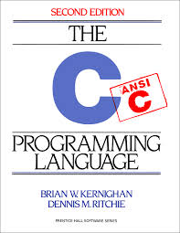

# Lab 01: Getting Started in C

Compiling, input/output, data types, and loops

[](https://en.wikipedia.org/wiki/The_C_Programming_Language)

C was created by [Dennis Ritchie](https://en.wikipedia.org/wiki/Dennis_Ritchie). [Brian Kernighan](https://en.wikipedia.org/wiki/Brian_Kernighan) wrote the first C tutorial. The first edition of this book written by them (called K&R for short) was published in 1978.


## Goals

After this lab you will be able to

1.  Follow the instructions for subsequent labs.
2.  Compile and run a C program from the command line in Linux.
3.  Submit code for evaluation on `Repl.it`.
4.  Create and use variables of the native types and obtain their addresses.
5.  Perform basic input and output on the console.
6.  Link to the standard math library
7.  Write loops using the `while` and `for` syntax.
8.  Write conditionals using the `if` syntax.
9.  Obtain the evaluation results through the version control system.


## [Introduction](#intro)

In this course you will complete a lab every week. Each lab contains several tasks, i.e., small assignments that are submitted individually.

[//]: # (Each lab task is automatically graded by a grading robot which downloads your code from your GitLab code repository (Git repo), then compiles and runs your code with several test cases. A test case comprises of an _input_ and a corresponding _expected result_. The grading robot checks that the output your code produces (_actual results_) matches the expected result for each test case and posts these results in a report to this link: `https://www2.cs.sfu.ca/CourseCentral/127/common/results/$USER`, which you can open in your web browser. Make sure you read and understand these reports, correct any bugs reported, recompile and retest your program (task), then push your task again onto your Git repo.)

[//]: # (Before you attempt this lab, you must successfully complete Lab 0, in which you set up your Git Lab code repository (Git repo) and set up the auto grading system by allowing the grading robots to access your code on your Git repo.)

## [Setup](#setup)


*** repl.it + canvas


    

#### [Task 1: Compiling and Hello World!](#task1)

  

#### Introduction

In this task you will 
1. write a very simple C program, 
2. compile it, 
3. run it, and 
4. read its output.

This series of activities: compile/run/check output against expected output, is called "testing".

Why compile code? Languages like Python are run inside an _interpreter_, a program that reads source code and executes it as it goes along. In contrast, C code is _compiled_ into programs (executable files) that run directly on the computer. The compiler does not run the program, instead it transforms it into runnable machine code. Compiled programs do not have the overhead of the interpreter when they run, so in theory they could run faster and use less memory, at the cost of the extra compilation step. Another advantage of a compiler over an interpreter is that once the compiler has created an executable file, this file can be executed over and over without having to be recompiled (compile once, execute many times).

Why C? The speed and small memory footprint of well-written C is the key to its popularity, along with the availability of a C compiler for almost every computer you can find, including small embedded devices. C also has good support for the low level operations needed to interact with hardware, while being tolerably easy for humans to read and write. C is a _lingua franca_ for application, systems and embedded programmers.

Much of the software you use every day is written in C or a descendant language and this has been true for many years. To get an idea of C's popularity, have a look at the language populatiry index from [Tiobe](https://www.tiobe.com/tiobe-index//) and from [SourceForge](http://lang-index.sourceforge.net/). A popular alternative to C is Java, which has a C++-like syntax but simplified memory management. Learning Java is easy if you know C++.

What follows is a simple but complete run-through of the workflow you will use to complete most of the lab tasks in this course. Don't be concerned if you find this task or this lab trivial, the tasks will become more challenging soon enough.

#### Requirements

Write a C program `t1.c` that writes the string `Hello World!` to standard output.

The requirements section is very important. It describes what your submission must do to pass the automated tests (the grading robot). It is marked clearly so you can't miss it.

  

#### Guide

The following C or C++ program prints a greeting to the standard output. Standard output, often abbreviated stdout is the name of a text stream that your command-line-based program uses to output text to the screen (or other places we will see later). You don't absolutely need to read it just now, but for reference [a thorough definition of standard output](http://www.linfo.org/standard_output.html) is given at [LINFO](http://www.linfo.org/), a great source of Linux information.

```{C}
#include <stdio.h>

int main( void )
{
   printf( "Hello World\\n" );
   return 0;
}
```

Let's examine the program line by line. Our goal is to use the C function `printf` to compose a chunk of text and send it to standard output (stdout). As we saw when we used the shell we can send the stdout to another program or to a file easily. Before we use `printf`, we need to tell the compiler where to find it so we import a declaration of its name and the arguments it accepts. This is provided with your compiler installation in the file `stdio.h`. The compiler is set up so that it knows where to look for it. It's often in `/usr/include`.

Line 1 copies the contents of `stdio.h` directly into the program code. Below the `#include` line we can call any functions declared in the included file, including `printf`.

Line 3 defines a function called `main` that returns an integer (`int`) and takes no arguments (`void`). C programs always start running at the `main` function. It's a bit more complicated in C++, but in both languages every program contains exactly one `main`, which is called by the operating system when the program starts. If you forget to define `main`, the compiler will report an error because it does not know where to start the program execution. The body of the function follows from line 5 to line 6, contained within curly braces `{ ... }`. Unlike Python, the C compiler ignores indentation and newlines completely: they are only used to lay out the code for humans to read. Spaces, tabs and newlines do nothing except separate the tokens - the linguistic atoms - of the language.

Line 5 uses `printf` to write a text string to stdout. As in many other languages, C strings are a sequence of characters contained within double-quote characters `"like this"`. We will come back to the details of C strings later. The string `"Hello World\n"` ends with a two-character **escape sequence** `\n` that represents the newline character. This is different from a `print` statement in Python that automatically ends the line for you: the C function `printf` does not. To have a newline in output, we have to represent it with this special escape sequence.

Line 5 is our first statement, a block of code that does some work. Statements end with a semicolon `;`. This is different from Python which uses newlines to end statements.

Line 6 causes the `main` function to return the integer value `0` (zero) as the result of the function. Back on line 3 we promised that the main function would return an integer, and the compiler would warn us if we forgot to do so. Since this is the `main` function, the caller is the command shell which invoked (ran) the program, which receives the value zero as the program's result. C programs always return an integer, and programmers conventionally use this value to indicate that the program was successful by returning zero, or a non-zero error code if something went wrong. We return zero to indicate that we detected no problems.

The guide section helps you through the process of meeting the requirements. Some tasks will have a long and detailed guide section, others will have only a brief note.

  

#### Compiling the program

Follow these steps to compile and test your program. Remember, "test your program" means: run it, read its output and make sure they match the expected output.

1.  Make sure you are in your lab working copy directory `1` by following the steps from the Setup section.
2.  Open a text editor. subl or gedit is installed for you in CSIL, easily available on all Linux systems, runs in a window and uses the well-known Windows keybindings. Of course, you can use any other text editor you like.
    
3.  Type in the code from the box above into a new file and save it as `t1.c`. C files conventionally have a .c suffix.
    
4.  Compile the source code file to create a binary file that can be run from the shell
    
        gcc t1.c
        
    
5.  If the program compiled correctly, the compiler created a new file in the current directory called `a.out` containing your executable program. Instead if you get error messages read them carefully, top to bottom and edit the code to fix the first reported error, then compile again. Once all looks well, run your program using its name like so:
    
        ./a.out
        
    
    (where "./" means "this directory"). You should see the expected output on your console:
    
        Hello World
        
    
6.  Specify a more descriptive name for your program than the default `a.out` with the compiler output name option `-o`:
    
        gcc -o hello t1.c
        ./hello
        Hello World
        
    
7.  You now have a working program written in C and built with your bare hands using only the command line. Not bad.
    

  

#### Testing and debugging

Testing is extremely important, and beginners often underestimate how much time and effort is required for good testing. In this case the test is easy and can be done by a human directly. Does the output text match exactly the required text?

Standard practice in software engineering, and for these labs, is to test the output of all your programs using automated scripts called **test drivers** (also referred to as unit tests). A test test is a very powerful tool for figuring out if your program works properly. It is much easier to write a nearly-correct program than a really-correct program. A good test driver will test to see if your requirements are met by trying a variety of test cases and checking for the expected output (expected results). Writing and using test drivers can significantly help with the quality of your software. You should write test drivers to make sure your code is correct before submission in all but the most trivial programs.

The grading robots uses test drivers (unit tests) for all your tasks. After submission, the grading robots run automatically. If you pass all the tests, you have successfully completed the task.

Do **not** ask the instructor/TAs what is in a particular test driver of the grading robots! Write your own test drivers instead to examine why you are failing the task. Your job is to solve the task, not to simply pass all the test cases.

1.  Fix the error in code in `t1.c` by adding the missing exclamation point.
2.  Compile and run it, and verify that it now produces the correct output (expected result).
3.  Now your program meets the Requirements and you are ready to submit it.

  

#### Submit your code to evaluation

First, add your new source code file to the Git repo, commit the current state of all added files, then push all local changes to the remote server.

    git add t1.c
    git commit -m "t1 works, so I'm submitting it"
    git push
    

**Do not add the `a.out` file or the `hello` file to your Git repo.**

  

#### Checking your results

You can check your results on your results page once the grading robot has executed. Refer to the **Check the automated grading server** section in Lab 0 for the link to the report web site the grading robots built for you.

In this class the grading robots execute every hour. This frequency has two purposes:

1.  It means you need to test your programs yourself, and not rely on the grading robots for your compile-test-debug cycle. Remember, testing is a critical skill in itself.
2.  It simulates the experience of contributing to a very large piece of software, where full-scale builds and tests can take hours or days.

#### [What does a compiler do?](#compiler)

Invoking the compiler `gcc` on the source code file `t1.c` did the following things:

*   First the _C preprocessor_ runs. It scans the file manipulating its text; mainly removing comments and newlines and _expanding macros_. C _Macros_ are preprocessor instructions beginning with a hash symbol `#`. The preprocessor replaces each macro with the results of the macro, which is always text. `#include` is a macro which causes the entire line it sits on to be replaced by the contents of the named file. Following the preprocessor run, we now have an intermediate C file that contains no comments or macros.
*   Next the _C compiler_ program runs and translates the C source code into assembler code that is specific to your CPU type. To see that this is so, let's ask the compiler to stop after this stage and take a look at the assembly generated for our program:
    
        gcc -S t1.c
        
    
    This produces a file called `t1.s` which you can view using `less t1.s` that contains the assembly output. Let's look at the assembly output for our hello world program.
    
    	.file	"t1.c"
    	.text
    	.section	.rodata
    .LC0:
    	.string	"Hello World!"
    	.text
    	.globl	main
    	.type	main, @function
    main:
    .LFB0:
    	.cfi\_startproc
    	pushq	%rbp
    	.cfi\_def\_cfa\_offset 16
    	.cfi\_offset 6, -16
    	movq	%rsp, %rbp
    	.cfi\_def\_cfa\_register 6
    	leaq	.LC0(%rip), %rdi
    	call	puts@PLT
    	movl	$0, %eax
    	popq	%rbp
    	.cfi\_def\_cfa 7, 8
    	ret
    	.cfi\_endproc
    .LFE0:
    	.size	main, .-main
    	.ident	"GCC: (Ubuntu 7.5.0-3ubuntu1~18.04) 7.5.0"
    	.section	.note.GNU-stack,"",@progbits
    
    Looking at this assembly, you can see why C and other high level languages were invented. They are a lot easier for humans to read and write. C and C++ have proven themselves to be at a sweet spot between human usuability and the efficiency of their code at run-time.
    
    At this point we still have a text representation of our program, now in a different language. The computer can not run it yet.
    
*   The next step is to translate the assembly representation into the binary format that the computer can read directly. This is now a sequence of numbers, each representing either a datum value, a memory address, or an actual CPU operation to perform (_opcode_). This is no longer readable by most humans, but it is a direct translation of the assembly so you can translate back and forth if needed.
    
    The program is now a chunk of binary data called an _object_, and the compiler writes it to a file in called an _object file_, which ends with `.o`, so `t1.c` creates `t1.o`. If multiple source files were compiled, each gets its own object file.
    
    To see this happening, we can ask the compiler to stop at the object stage:
    
        gcc -c t1.c
        
    
    The working directory will contain the file `t1.o`. Opening this in an editor, you will see a lot of unreadable stuff, with some familiar bits here and there, such as the string _Hello World_ which is stored in the object as data. You'll also see the function names `main` and `printf` which are kept around in human-readable form in case we want to debug the program as it runs.
    
*   The final stage is to _link_ together all the object files, along with any code libraries they referenced, to create the complete executable program. Code libraries are just collections of `.o` object files all smooshed together with an index at the start. (Object files are often small and numerous, so collecting them simplifies distribution).
    
    Invoking the compiler with our object file will do the link:
    
        gcc -o t1 t1.o
        
    
    This will create a new executable called `t1` in the current directory. Done.
    

Now you have seen a typical C compiler process from start to finish. In practice you will almost always let the compiler do the whole thing at once for you. It deletes the intermediate files when it's finished with them, so you won't even see them unless you look hard.

#### [Workflow](#workflow)

The first task is complete. The remaining tasks have the same workflow.

1.  Read the introduction (Step 1 - Problem Statement and Requirements).
2.  Carefully read the Requirements (Step 1 - Problem Statement and Requirements).
3.  Read the Guide to help you get started (Learning moment).
4.  Think, and maybe repeat the prior steps (Step 2 - Design).
5.  Implement some code (Step 3 - Implementation).
6.  Test, and repeat last step until your code passes the test (Step 4 - Compilation and Testing).
7.  Commit changes to your local repo.
8.  Push your committed local changes to your Gitlab repo.
9.  Look at the results from the grading robot (after some delay) on your **results** web page.

#### [Task 2: Native types and printf](#task2)

  

#### Introduction

C is a _strongly typed_ language. That is, all variables have a _type_ that identifies the kind of data they store. Types include integers, floating point numbers, and characters. Every variable has a _value_ which is the data it stores. A variable's type is specified at its creation.

The value of a variable can change, but its type can not. Thus C is a _statically typed_ language. This is fundamentally different to Python, where variables could contain different things during their lifetime.

The advantages usually claimed for strong, static typing are

1.  Explicit statement of intent. You tell the compiler and people reading the code what kind of data you are manipulating.
2.  Error prevention at compile time. If you violate your stated intent, the compiler lets you know right away.

  

#### Variables and output

Let's look at a C program that creates some variables and prints them.

1.  #include <stdio.h>

3.  int main( void )
4.  {
5.   int i \= 0;
6.   float pi \= 3.14159;
7.   char c \= '+';

9.   // this is a comment
10.   printf( "Here: %d %f %c\\n", i, pi, c );

12.   return 0;
13.  }

Which produces this on stdout

    here: 0 3.141590 +
    

We initialize the variables to a value with the `=` operator. C does not require that variables be initialized, but it's a good practice so we will always do so.

Line 9 is a comment. As in most languages, comments are notes for human readers only, and are ignored by the compiler. Comments come in two styles

    /* The  multi-line comment style: everything between the 
       slash-star and star-slash is ignored */
    // The single-line comment style: the remainder of the line is ignored.
    

Line 10 calls `printf` which allows you to print all the native variable types. Using `printf` is similar to using the `%` idiom in Python's `print` function. `printf` is less flexible about its input than Python's `print`, but you can do a lot with it.

The first argument to the `printf` function is a `"format string"`. This is a template that specifies the text to output, including specifiers: codes that begin with `%` that are to be replaced by text representing the values of subsequent arguments to printf. In the example, the format string is `here: %d %f %c\n`. This tells printf that the next three arguments will be an integer decimal (%d), a floating point decimal (%f) and a character (%c). The compiler will check that you supplied the correct number and type of arguments.

Notice that the floating point number was printed with a zero on the end that did not appear in the source code. This is because printf prints the value of a float to a default precision. This can be set explicitly by stating how many digits you want after the decimal point, e.g

    float pi = 3.14159
    printf( "%.2f\n", pi );
    

Which prints

    3.14
    

Above we said that printf is expecting a sequence of variables after the format string. In fact, any expression can be used. An expression in C is a sequence of variables, operators and function calls. The following are valid simple expressions

    a
    a+b
    a*(b+c)
    a*sqrt(b)
    

In the last line above, we are calling a function `sqrt` as part of the expression to get the square root of the number `b`.

The result of any given expression is always a value with a type. This means that an expression can be used anywhere a value is expected, such as following the format string in a call to printf. For example, the following is valid

    int a=2;
    int b=10;
     
    printf( "the product of a and b equals %d\n", a*b );
    

That's the basics of text output in C.

  

#### Types and storage size

C has several native (i.e. predefined) variable types. They differ by the kind of value they store and by the range of possible values.

Here are the most commonly used:

NOTE: Notice that the caption in the integer table below says _minimum width_. This is because the C standard says only that integers must be at least this size. They can be larger, and your compiler will use the sizes that are most efficient for your machine. Task 2 is to write a program to find out the sizes of all these data types on the machine that runs it. The sizes your Task 2 will display will most likely be different than the figures displayed in the table below.

**Standard integer types**

Type specifier

Minimum width (bits)

Minimum value

Maximum value

`char`

8

\-127

127

`unsigned char`

8

0

255

`int`

16

\-32,767

32,767

`unsigned int`

16

0

65,535

`long`

32

\-2,147,483,647

2,147,483,647

`unsigned long`

32

0

4,294,967,295

**Floating-point types**

Type specifiers

Precision (decimal digits)

Exponent range

Minimum

IEEE 754

Minimum

IEEE 754

`float`

6

7.2 (24 bits)

±37

±38 (8 bits)

`double`

10

15.9 (53 bits)

±37

±307 (11 bits)

`long double`

10

34.0 (113 bits)

±37

±4931 (15 bits)

There are also _pointer_ types for each one of these. We will discuss pointers later.

[A complete list of the native types is available at Wikipedia](http://en.wikipedia.org/wiki/C_syntax#Primitive_data_types).

Why have all these types? The most important distinction is between integer and floating point types, which represent numbers differently. Integer types represent integer values exactly, but over a limited range, with the range determined by the number of bits. Floating point types represent real-number values approximately, with the precision of the approximation determined by the number of bits.

We could manage with one type for each of integer and floating point, but C was designed with compactness and efficiency in mind. Thus C allows (indeed, requires) the programmer to specify the storage space versus range/precision trade-off for each variable. This design decision was perhaps easier to justify in 1971 than today, but memory is still precious on your smartphone, and even more so on a microwave oven and on the robots currently on Mars.

  

#### Characters and Strings

A character in C is written using a single quote character, e.g. `char x = 'a';` assigns the value of the character `a` to the variable `x` of type `char` (or character for short). The type `char` uses 7 bits so it can represent 2^7 or 128 possible values. To see these values in more details use the command

    man ascii
    

and look at the decimal set which shows the different characters used in C. This representation is called [ASCII](https://en.wikipedia.org/wiki/ASCII). As you can see from the ascii table, each character is simply a number that is printed out as a particular letter of the alphabet. The ascii table also includes unprintable characters (usually called control characters). The visible letters of the English alphabet and punctuation have values between 32 (the space character) and 126 (`~`). Special symbols like the newline character (`'\n'`) also have ascii values, for instance the newline is the number 10. Lowercase letters of the English alphabet also have decimal values starting from 97 (`a`) until 122 (`z`). So `char x = 97;` is exactly the same as `char x = 'a';`. Either definition of `x` can be printed as the English letter by using `printf("%c", x);`.

A string in C is a sequence of characters (or an array of characters) terminated by a zero value. By default C will zero terminate a string.

    char coursename[] = "CMPT 127";
    

Each element of the array `coursename` is a character, e.g. `coursename[0] = 'C'`.

#### Requirements

1.  Write a new C program in a file called `t2.c`
2.  Write a program that outputs the storage size **in bits** of each type from the tables above on standard output.
3.  The sizes should be listed in the order they appear in the preceding tables.
4.  Output values should be contained on single line, each separated by a single ' ' (space) character.
5.  The line should end with a newline.
6.  Example output:
    
        8 8 16 16 32 32 32 64 128
        
    
7.  Note that the exact values printed will probably be different - very likely larger - on your machine. The values in the example output was taken from a vintage 1980s computer.

  

#### Guide

C provides a `sizeof` [operator](http://en.cppreference.com/w/c/language/sizeof) that tells you the storage size of any type in bytes. For example:

    printf( "%lu\n", sizeof(int) );
    

Results in

    4
    

on my machine. Note this is larger than the minimum 2 bytes required by the standard. This is because the architecture of my machine handles data in 4-byte chunks more efficiently than 2-byte chunks.

The `printf` format string contained the `%lu` format specifier, which prints a unsigned long integer type. I chose this format because on my 64-bit machine `sizeof` outputs an unsigned long (storage size can only be positive). If you are using a 32-bit operating system, you might need to use "%u" instead of "%lu". The compiler will complain if you have the wrong format.

`sizeof` also accepts a variable name for its argument. It figures out the type automatically

    unsigned int a=73;
    printf( "%u %lu\n", a, sizeof(a) );
    

Results in

    73 4
    

Note that the requirements ask for the value in bits and not bytes. There are usually 8 bits in a byte. The number of bits in a byte on your machine is defined in the file `limits.h` in the variable `CHAR_BIT`

#include <stdio.h>
#include <limits.h>

int main( void ) 
{
  printf("number of bits in a byte: %d\\n", CHAR\_BIT);
}

Do not be tempted to just print the example output. Your code might be tested on a very weird machine.

As reminder, here's an example of building and running your new program

    gcc -o sz t2.c
    ./sz
    8 8 32 32 64 64 32 64 128
    

  

#### Testing your program

Once you believe your program meets the requirements (i.e., you have compiled and tested your code successfully and your program is now solving the problem stated in the task), you are now ready to submit your program (task) to your Git repo. Remember, you won't get feedback from the grading robot for a while, so think about how you might test your program before submission to maximize the chances of it being correct. For example, you might find out which CPU your machine has and look up what its native sizes are.

  

#### Submission

Submit your solution by checking it into Git as before

    git add t2.c
    git commit -m "t2 submission"
    git push
    

  

#### Last thing!

There are two data types that have not yet been discussed in this lab: `signed short` (which is more commonly referred to as `short`), and `unsigned short`.

Take a moment to investigate them on the Internet. What is the size (in bits and bytes) of these two data types? What are the minimum and the maximum values we can store in a variable of type `short` and of type `unsigned short`?

#### [Task 3: Input and pointers](#task3)

  

#### Introduction

Now let's look at a C program that inputs an integer from the user and echoes it back

1.  #include <stdio.h>

3.  int main( void )
4.  {
5.   int i \= 0;

7.   printf("Enter an integer: ");

9.   scanf( "%d", &i );
10.   printf( "Your integer was: %d\\n", i );

12.   return 0;
13.  }

There are two new things on line 9. The function `scanf` is roughly the inverse of `printf`, reading text from _standard input_, a text stream directly analogous to standard output but in the other direction. Text from the shell is delivered to a program's standard input (`stdin` for short) and is queued there until the program chooses to read it. The shell program and the computer's operating system work together to make this happen. We will see later that this simple scheme can be very powerful.

The arguments to `scanf` is a format string, similar to that of `printf`, which is a template to be matched against the input. The format string specifiers (starting `%`) indicate that the text in this place in the input string should be interpreted as a specific type, and stored in the variable indicated by the next argument. A variable of a suitable type must be supplied following the format string, and they are used in order.

The format string argument to scanf `%d` says we should interpret the entire line as a decimal integer. Whitespace around the number is ignored.

Since `scanf` is expecting a decimal integer, we have to supply a variable in which to store the value. We created an integer for this purpose on line 5. So what is the purpose of the ampersand `&` before the argument `i` on line 9?

  

#### Pass by value

A fundamental feature of C is that arguments to functions are _passed by value_. Inside the called function, we see only the value of the arguments we were called with. If we do omit the `&` before the argument `i` we get an error message.

    int i = 0;
    scanf( "%d", i ); // ERROR!
    

Then `scanf` sees the format string as its first argument, and the value zero as its second argument. This is no use to `scanf`! It needs to store the value it has extracted from the input string somewhere. We wanted to tell `scanf` about the variable `i`, not the value of variable `i`. How do we get around this apparent limitation?

  

#### Pointers

The answer is a very important concept in C, the _pointer_. The pointer allows us to represent where things are stored in memory. This is a simple idea, but pointers are often considered tricky.

Computer Architecture reminder: The computer makes memory available to your program as a simple _address space_, with each byte of memory having a unique numeric address, numbered from 0 to the size of the space. This is determined by your machine type, but is typically 2^32 (4GB or around 4.3 billion bytes) or 2^64 (a _very_ large number). Every address contains a single value from 0 to 2^8 (255). The address space can be visualized as a stack of mailboxes, numbered from zero, each containing a number.


This point is crucial: each mailbox _has an address_, for example 114 in the picture. And that mailbox _contains a value_. If you open the door of mailbox 114 and you see a note with "93" written on it, we say the value 93 is stored at address 114.

If you have used a spreadsheet, you are familiar with this idea. The address of a cell is its coordinate (e.g., C2), and the value of the cell is the number it contains. The memory space of a C program is like a spreadsheet with only one column.

Consider this sketch of our program's one-column address space:

     Address   Value
     2^n          0
       .          .
       .          .
       7          0
       6          0
       5          0
       4         42
       3          0
       2          0
       1          0
       0          0
    

The address space is listed on the left - the stack of uniquely numbered memory slots, and the value contained in each listed on the right. The value in memory address 4 is 42. Conversely, the _address of_ that byte with value 42 is 4.

Now we can see how variables are actually implemented in C. When you declare a variable, e.g., `char c=42;`, the compiler chooses a currently unused address to contain it, say address 4, then writes the initial value 42 into the memory at that address. Every time the program refers to the value of c, this means the value stored at address 4.

Often you need to manipulate values larger than 2^8. To support this the compiler allocates a sequence of addresses with enough space to store a value of the variable's type. The lowest-numbered address is the _address of_ the variable. The _int_ type is used to store integers. It is often 32 bits long and thus need 4-bytes of address space. In our example, the compiler has decided that integer `i` will be stored in the 4 bytes starting at address 4. The value of 42 for `i` fits in the first byte, but we might increase it later such that addresses 5, 6 and 7 would have non-zero values too.

     Address   Value
     2^n          0
       .          .
       .          .
       7          0                  |   byte 3 
       6          0                  |   byte 2
       5          0                  |   byte 1
       4         42     <---- int i -    byte 0 
       3          0
       2          0
       1          0
       0          0
    

After compilation, your integer variable originally called `i` or `highscore` or `answer_to_everything` just becomes "the value of the 4 bytes starting at address 4 representing an integer". Variable names are just for humans and the compiler.

**It's important to remember this simple model of data storage in C: the computer uses both (i) an _address_ to locate the start of sequence of bytes; (ii) a _type_ to understand how long the sequence is and how to interpret it.**

Python and many other 'high level' languages have different storage models and you rarely have to think about them. That's part of what 'high level' means. C allows/requires you to think about data storage more directly.

  

#### Pointers solve the pass by value problem

At this point you may have figured out the purpose of the ampersand operator `&`. It means "address of" the variable to its right. We can fix the fragment above using this operator:

    int i = 0;
    scanf( "%d", &i ); // fixed using &
    

Now `scanf` receives the format string followed by the _address of_ variable `i`. If `i` has the address 68, then `scanf` receives the value 68. It now knows where to store the integer it reads from standard input. A value that represents a memory address is called a _pointer_, since it _points to_ where its target is stored.

Remember: pointers allow programs to represent and manipulate memory addresses. This is a very powerful tool. We have seen how it solves the apparent limitation of the pass-by-value mechanism. We will come back to pointers later.

Many languages, e.g., Java, do not allow you to use pointers, and have _references_ instead. These are implemented internally as pointers, with an extra little safety net limiting how you use them. C has only pointers, for simplicity. C++ has both pointers and references.

Now you know how to pass a pointer into `scanf`, we are ready for the task at hand.

#### Requirements

1.  Write a new C program in the file `t3.c`.
2.  Write a program to read a floating point value from standard input, then output
    1.  The largest integer smaller than or equal to this value;
    2.  The nearest integer to this value, with halfway values rounded away from zero;
    3.  The smallest integer larger than or equal to this value
3.  The output integers should be separated by a space character and followed by a newline character.
4.  The output values should not have any trailing zeros: e.g. `2` not `2.0`.
5.  Sample input: `3.1415`
6.  Corresponding output: `3 3 4`
7.  Remember to consider negative numbers (which are also valid integers).
8.  Be careful about whitespace at the start or end of each line in your output.
9.  Remember that the sample code above was for you to run, the computer does not need to be prompted for input so do **not** use any `"Enter an integer:"` or `"Enter a floating point number:"` prompts in your code.

  

#### Guide

The format string syntax for `scanf` is very nearly the same as for `printf`. The format specifier for floating point numbers is `%f`.

C comes with the _standard library_, which contains many useful basic functions, including `printf` and `scanf`, and many mathematical functions. These functions and their documentation _man pages_ are available on almost all platforms, via the _man_ program we used briefly above.

For example, you can look up your local man page for `scanf` like so:

    man scanf
    

The (very detailed) man page for scanf and related functions lists all the format strings it understands. You only need "%f" for this task.

Press the `q` key to exit the man page viewer.

Notice that the required header(s) are listed at the top of the man page for each function. The exact headers needed varies slightly by system, so check your local man pages.

The man page system is widely available and usually very detailed. The main problem with it is that you need to know the name of what you're looking for. Happily, all the web pages are online and indexed by the web search engines. Double check your local man pages after looking online, due to the minor differences between platforms.

Three functions will be helpful for this task: `floor`, `ceil` and `round`.

These and most other math functions require the `math.h` header:

    #include <math.h>
    

Note that these functions return values of type **double** and not **int**. Thus you need the appropriate `printf` format string if you print their results directly. You can **coerce** a double value into an int value by asking C to convert it for you. For example, the following code converts a double value and prints it as an int value.

    #include <stdio.h>
     
    int main( void )
    {
      double i = 3.14159;
      printf( "%d\n", (int)i);
      return 0;
    }
    

If you remove the `(int)` from the `printf` call, the compiler will give you some warnings about trying to print a double value as an int. In this case, you can safely ignore those warnings or add in the `(int)` type cast to get rid of the warnings.

To see what each function does, check the system manual page like so:

    man floor
    man round
    man ceil
    

Again, press the `q` key to exit the man page viewer.

  

#### Linking a library

The functions declared in `math.h` are not built-in to C. They are optional extras that are available as standard in most installations. The core of C is very small, and it comes with a _standard library_ of extras, including these math functions. To use them you have to `#include` the `math.h` file, and then _link_ the math library into your program, which adds the code for the math functions you use into your program. This is done explicitly in the compile command like so

    gcc -o t3 t3.c -lm
    

The `-lm` suffix means link (`-l`) the math library (`m`). C tools are terse like that. The link command comes after the name of the source file(s), so that the compiler knows which functions are needed from the library.

  

#### Testing your program

Once you believe your program meets the requirements you are ready to submit.

  

#### Submission

Submit your solution by adding, committing and pushing to your Git repository as before:

    git add t3.c
    git commit -m "t3 submission"
    git push
    

#### [Task 4: Conditions with if and else, return values](#task4)

  

#### Introduction

The previous task produced a very fragile program. What if the user typed in something than could not be interpreted as a floating point number? Try it and see what happens. Does it make sense?

We have reached a very important point. Assuming your code perfectly meets the requirements above, you can say it is correct. But "correct" is defined by reference to the requirements. This code is not robust when the user is free to type in arbitrary things into standard input. We can improve the requirements by specifying what the program should do in the case of failures. It is important to see that correct code may not be reliable in the real world, and that the task of specifying requirements is a large part of the work of programming.

To write robust software that does the right thing even when used roughly, we first need to extend the requirements to specify what to do when things go wrong. Then in the code we test things as we go along, using _conditionals_: keywords that change the program's behaviour depending on the value of a statement at the time it is executed. C's basic conditional is `if` and it has the form:

    if( statement )
    {
        /* this block is executed if and only if _statement_ evaluates to true (non zero) */
    } 
    

or

    if( statement ) {
        /* this block is executed if and only if _statement_ evaluates to true (non zero) */
    } 
    

For example:

    if( s > highscore ) {
        highscore = s;
    }
    

An optional `else` block can be added that will run only if the condition is false. Thus you can choose between two courses of action, for example:

    if( s > highscore ) {
        highscore = s;
        printf( "Congratulations on a new high score!\n" );
    } else {
        printf( "Bad luck. Try again\n" );
    }
    

  

#### Code blocks and indentation

The block of code after a conditional is contained in curly braces `{ ... }`. In Python block structure is indicated by indentation, but in C and many other languages, indentation is not significant, and is only there for the comfort of the human reader. This is still _very_ important, so you should follow the conventional indentation style used here and stick to it.

  

#### Return values

Functions often return values to the caller. For example, `scanf` returns an integer that indicates the number of successfully assigned variables, possibly 0 if none were assigned.

We capture the return value using the _assignment operator_ \=. We used this already in variable declarations to indicate an initial value (this is always a good idea, since C does not usually initialize variables for you).

Assignment examples:

    int a = 0; // ensures a does not have a random initial value
    a = 5;   // change the value of an already-declared variable
    
    a = scanf( "%d", &b ); // if b is set successfully, a will be set to 1. If not, a will be 0.
    

You should almost always check the return value (or other error-reporting mechanism) for any function call that could possibly go wrong or weird. This is a key basic strategy in [Defensive Programming](http://en.wikipedia.org/wiki/Defensive_programming) which aims to protect against [Finagle's law](http://en.wikipedia.org/wiki/Finagle%27s_Law).

#### Requirements

1.  Copy your solution for Task 3 `t3.c` to a new file `t4.c`.
2.  The input is guaranteed to contain at least one non-whitespace character.
3.  If the input is well-formed, i.e., can be parsed to a number, the program should behave identically to Task 3. All the requirements of Task 3 still apply except the file name.
4.  If the input is not well formed, the program should print a helpful error message that contains the value returned by `scanf` so that the programmer can compare this number with the `scanf` documentation to figure out what went wrong. (If this program was aimed at end-users, we might design this differently).
5.  The error message should be in the form: `"scanf error: (%d)\n"` with the `scanf` return value between the parentheses.
6.  Sample input: `3.1415`
7.  Corresponding output: `3 3 4`
8.  Sample input: `sausage`
9.  Corresponding output: `scanf error: (0)`
10.  Be careful about the spaces, for instance, the space between the `:` and `(` in the error string.

  

#### Guide

You should test the return value of `scanf` to decide whether a floating point value was detected in the input.

Here's the list of _infix_ comparison operators. When placed between two expressions (hence the term "infix"), these result in a value of false (zero) or true (usually 1, but any non-zero value evaluates true when used in a logical expression).

name

syntax

equal to

\==

not equal to

!=

less than

<

greater than

\>

less than or equal to

<=

greater than or equal to

\>=

  

Notice the _equal to_ operator "==" is distinct from the assignment operator "=" . Mixing these up is a common bug for C beginners. Double-check every time you intend to use "==".

  

#### Testing and Submission

Test, test, test again, then submit as usual.

Testing and submission instructions will be omitted from now on, unless there is something special about the particular task. Unless otherwise specified, submit a source file called `tX.c` where X is the task number.

#### [Task 5: Loops](#task5)

  

#### Introduction

Now our number-rounding program can detect input scanning errors, but it still only works for one number. Let's extend it to handle any number of inputs. For this we need to repeat part of our program to deal with each value that comes. We need a _conditional loop_. C has only two options: while and for.

  

#### While loops

The while keyword has the following form:

    while( condition )
    {
        // this block executes repeatedly as long as condition evaluates to true
    }
    

or

    while( condition ) {
        // this block executes repeatedly as long as condition evaluates to true
    }
    

For example this code:

int i\=0; while( i < 6 ) { printf( "%d ", i ); i++; } printf( "\\n" );

produces the output

    0 1 2 3 4 5
    

The repeating block of code is contained in curly braces `{ ... }` the same as with the conditional structure we saw earlier.

Note the use of the _increment operator_ ++ which adds one to its argument. i++ is a shortcut for i=i+1. This, along with the _decrement operator_ - are frequently used. Now you know how C++ got its name.

The condition can be inverted with the logical _not operator_ !, so the following does the same:

int i\=0; while( ! (i \== 6) ) { printf( "%d ", i ); i++; } printf( "\\n" );

It is important to note that if the while condition is false on the first evaluation, the body of the loop is never executed. Think of it like an if statement that repeats until it is false. Occasionally it is useful to have the body of the loop run at least once before testing the condition, so there is an alternate form: the do-while, like so:

    do 
    {
        // this block executes at least once, 
        // then repeats as long as
        // condition evaluates true
    } while( condition );
    

or

    do {
        // this block executes at least once, 
        // then repeats as long as
        // condition evaluates true
    } while( condition );
    

For example this code:

int i\=0; do { i \= getNextValueFromDatabase(); } while( i <= 1000 )

will get at least one value from the database, and will repeat this until it fetches a number bigger than 1000.

This is a dangerous example, since if all the values in the database are less than 1000, this program will happily run forever. This could be a nasty bug since your test database is probably different from those of your customers. You should be looking out for problems like this whenever you write a loop. To produce high quality code, you need to be always thinking, "What could possibly go wrong here?"

  

#### For loops

The pattern above, where we initialize a variable, test its value, then perform a loop that changes the value, is so frequently used that it has a special syntax: the _for loop_, which has the form

    for( initialize; condition; modify )
    {
        // this code runs until condition evaluates to false 
    }
    

or

    for( initialize; condition; modify ) {
        // this code runs until condition evaluates to false 
    }
    

Any valid C expression can be used in each of the three for() components, separated by semicolons. But they are usually quite simple. For example:

for( i\=0; i<6; i++ ) { printf( "%d ", i ); } printf( "\\n" );

is functionally identical to our first while example.

Every for loop has an equivalent while, and _vice versa_, so choose whichever is neatest for the loop at hand.

  

#### Break

You can break out of a loop body with the break; statement. For example, this code:

for(  i\=0; i<1000; i++ ) { if( random() % 100 \== 0 ) // random() is defined in stdlib.h break; printf( "%d ", i++ ); // prints the value and \*then\* increments it }

will print integers in sequence from 0, but has a 1% chance of leaving the loop every time around. The function random() returns a random integer and the % operator is the integer modulus operator, so the code will print consecutive numbers up to 999 or until random() returns a multiple of 100, whichever comes sooner.

  

#### Continue

You can jump to the beginning of a loop body with the continue; statement. For example, this code:

for( i\=0; i<1000; i++ ) { if( random() % 100 \== 0 ) continue; printf( "%d ", i++ ); // prints the value and \*then\* increments it }

will print integers of increasing value, but every loop iteration has has a 1% chance of jumping to the beginning of the loop without printing. Thus this code will continue to loop until it reaches 1000, but might skip a few numbers.

Challenge! Can you write your programs without using _break_ or _continue_?

That is all there is to loops in C.

  

#### EOF: the end of the file

The standard input stream to your program behaves as if it was a file. One of the most powerful ideas behind the design of the UNIX operating system and environment is that ["everything is a file"](http://en.wikipedia.org/wiki/Everything_is_a_file). Since stdin behaves like a file, it can have an "end".

The shell program connects your typed input to your program's stdin. We can break this connection by typing the special character sequence `Ctrl-d`, that is press-and-hold the control key, then press 'd', then release the control key. The shell receives this command, sends a special "End-of-file" or **EOF** indicator to the connected stdin, and then closes the connection.

Inside the running program, the EOF indicator is detected by input functions such as `scanf`. `scanf` will return an integer with a special value to indicate EOF. This is often -1, but the actual value depends on your system. The standard library defines the symbol "EOF" which has the correct value for your system. You can use it like so:

int i\=0; int result \= scanf( "%d", &i ); if( result \== EOF ) // note double-equals for comparison! { printf( "End of file detected\\n" ); }

By definition, once an EOF is seen in an input stream, any subsequent read will also return EOF.

We can use the combination of conditional loops and EOF indicator to make the rounding program work for an arbitrary number of input values.

#### Requirements

It is very IMPORTANT that you read ALL the requirements for this Task 5 before you start writing your program. Pay particular attention to the **Important Note** below describing the input and output being interleaved on the monitor screen.

1.  Save your program to the file `t5.c`.
2.  Write a program to read any number of floating point values from standard input, separated by newlines.
3.  The input may also contain any number of blank lines, i.e. lines that contain any amount of whitespace followed by a newline.
4.  With the exception of blank lines, the input is guaranteed to be well-formed and contain at least one valid floating point value. Therefore, there is no need for our t5.c program to print a helpful error message (as we did in Task 4 when the input was not well formed).
5.  For each value input, output (as before):
    1.  The largest integer smaller than this value;
    2.  The nearest integer to this value, with halfway values rounded away from zero;
    3.  The smallest integer larger than this value
6.  For each input value, the output integers should be separated by a space character and followed by a newline character.
7.  The output values should not have any trailing zeros: e.g., "2" not "2.0".
8.  If no floating point value can be parsed (i.e. a blank line was read) there should be no output. To put it another way: blank lines should be ignored.
9.  The program should accept input values on stdin until EOF is reached.
10.  When EOF is reached, print `Done.\n` on line by itself, then exit the program. This line has a `.` at the end of it. Pay attention to small details.
11.  Sample input:
    
        3.1415
        7.11
        -15.7
        
    
12.  Corresponding output:
    
        3 3 4
        7 7 8
        -16 -16 -15
        Done.
        
    

**Important Note:** Your input and output are interleaved in the terminal window, so if you type in the numbers and press enter after each line then the _appearance_ of a run of a correct program with the input above is:

    3.1415
    3 3 4
    7.11
    7 7 8
    -15.7
    -16 -16 -15
    

It's important to realize that the above output consists of alterating line of input and output, each three lines long.

If you construct the input and feed it using shell commands you will see only the output of your program

    gcc -o t5 t5.c -lm
    echo "3.1415 7.11 -15.7" | tr ' ' '\n' | ./t5
    

The `-lm` suffix means link (`-l`) the math library (`m`). The link command comes after the name of the source file(s), so that the compiler knows which functions are needed from the library.

Then the output will be

    3 3 4
    7 7 8
    -16 -16 -15
    Done.
    

  

#### Guide

Try to write code that is readable. Make the code self-explanatory to someone else who might read your program and try to use it.

  

#### Testing coverage

Don't forget to test yourself interactively on a variety of inputs. One is not enough. Your job is to find bugs before our grading system does. Think "what can I possibly do to make it go wrong?".

As always, make sure your program meets the requirements. Here is a key idea: **perform a test that covers every requirement**, including those about malformed input and empty lines. Your tests should also exercise every line of your program, including every possible branch due to a conditional. This is the principle of _coverage_. We will talk more about testing strategies later.

It's also important to understand that **a program that passes all the tests may not be correct**. While our online tests aim to cover a variety of input cases, we don't know what's in your program, so we can not guarantee code coverage.

Only you can ensure your code is correct!

#### [Task 6: Simple statistics](#task6)

  

#### Introduction

An exercise in computing elementary statistics over a set of input values. You will need to loop over a `scanf` and check its return value to detect the end of the input.

#### Requirements

1.  Save your program to the file `t6.c`.
2.  Read floating point values from stdin, each separated by a newline, and terminated by EOF.
3.  The input values are in the range \[-100,000 to +100,000\].
4.  The input will contain at least one floating-point value.
5.  The input may contain blank lines: these should be ignored.
6.  Apart from possible blank lines, the input is otherwise well-formed.
7.  At EOF, output:
    1.  The smallest value seen.
    2.  The largest value seen.
    3.  The arithmetic mean of all the values seen.
8.  All output must be accurate to two decimal places.
9.  The output values must be separated by a single space character and followed by a newline character.
10.  Examples:
    1.  *   Input:
            
                7
                5.6
                6
                
            
        *   Output:
            
                5.60 7.00 6.20
                
            
    2.  *   Input:
            
                11
                
            
        *   Output:
            
                11.00 11.00 11.00
                
            

  

#### Guide

Note that you do not have handle arbitrary text in the input. Only well-formed numbers and empty lines.

The [definition of the arithmetic mean](http://en.wikipedia.org/wiki/Arithmetic_mean).

#### [Task 7: Horizontal graph](#task7)

  

#### Introduction

Write an easy but useful graphing program.

#### Requirements

It is very IMPORTANT that you read ALL the requirements and the examples for this Task 7 before you start writing your program. Pay particular attention to the **Important Note**'s below describing the input and output being interleaved on the monitor screen.

1.  Save your program to the file `t7.c`.
2.  Read an arbitrary number of positive integer values from stdin. The values are separated by one or more spaces or by newlines (only - no other characters must separate them).
3.  The input is guaranteed to be well-formed.
4.  On standard output, render a simple graph representation of the input values, in order, using hash `#` characters as shown in the examples below. The number of hashes printed should be equal to the input value.
5.  Your program should output exactly one line per input value.
6.  The value zero should generate an empty line, i.e. just a newline character.
7.  Ignore empty lines. Do not output a newline for an empty line.

  

#### Examples

Input

    5 4 3 2 1
    

Output

    #####
    ####
    ###
    ##
    #
    

**Important Note:** For this example, the output is displayed after you have typed the input in the terminal window, so the appearance of the run of a correct program with the example above is:

    5 4 3 2 1
    #####
    ####
    ###
    ##
    #
    

Input

    16
    0
    4
    12
    

Output

    ################
    
    ####
    ############
    

**Important Note:** Your input and output are interleaved in the terminal window, so the appearance of the run of a correct program with the example above is:

    16
    ################
    0
    
    4
    ####
    12
    ############
    

Input

    1 1 3 
    2 1
    

Output

    #
    #
    ###
    ##
    #
    

**Important Note:** Your input and output are interleaved in the terminal window, so the appearance of the run of a correct program with the example above is:

    1 1 3 
    #
    #
    ###
    2 1
    ##
    #
    

Input

    3
    
    
    2
    1
    

Output

    ###
    ##
    #
    

**Important Note:** Your input and output are interleaved in the terminal window, so the appearance of the run of a correct program with the example above is:

    3 
    ###
    
    
    2
    ##
    1
    #
    

In the next lab we will see how to use files with stdin and stdout to avoid this unsightly mess.

One way around entering input over and over again to test your program is to use some shell mojo:

    gcc -o t7 t7.c
    echo "1 1 3#2 1" | tr '#' '\n' | ./t7
    #
    #
    ###
    ##
    #
    

  

#### Testing and Submission

As usual. Don't forget the requirement that the program accepts arbitarily input. This includes empty, very large and very small input values. Test these cases. Finally, ensure that your displayed results meet the specifications (requirements).

#### [Task 8: Pyramid Projection 1](#task8)

  

#### Introduction

This exercise has more complex requirements. You can meet them with some quite simple, compact code. The main challenge here is formulating the problem as a computation.

#### Requirements

1.  Save your program to the file `t8.c`.
2.  Read a line containing three positive integer values greater than 0 from stdin. The values are separated by one or more spaces.
3.  The input is guaranteed to be well-formed.
4.  The values represent the width (x dimension), breadth (y dimension) and height (z dimension) of a symmetrical rectangular-based pyramid, respectively. The height is measured perpendicularly from the base of the pyramid.
5.  All values will be in the range \[1..50\].
6.  On standard output, render a view from **above** the pyramid, showing its rectangular base, i.e., the projection of the pyramid onto the plane z=0. In this view, x increases from left to right, and y increases from bottom to top.
7.  Draw the outline of the pyramid with the `#` character. The outline must approximate the pyramid's boundary as shown in the examples below and described in the next two requirements.
8.  The top and bottom rows shall be drawn with exactly _width_ `#` characters.
9.  For every remaining text row, either one or two `#` characters shall be drawn, covering the left-most and right-most position on that row intersected by the edge of the pyramid,
10.  Any non-boundary area inside the shape must be filled with the `.` character.

  

#### Examples

You'll need to use a fixed-width font in your terminal for these shapes to look right in your output. (If the examples below don't look symmetrical in your browser, check that your `pre` font is fixed-width.)

Input

    6 6 4
    

Output

    ######
    #....#
    #....#
    #....#
    #....#
    ######
    

Input

    7 7 4
    

Output

    #######
    #.....#
    #.....#
    #.....#
    #.....#
    #.....#
    #######
    

Input

    6 4 2
    

Output

    ######
    #....#
    #....#
    ######
    

Input

    6 2 4
    

Output

    ######
    ######
    

Input

    1 1 1
    

Output

    #
    

  

#### Testing and Submission

As usual.

When testing yourself, don't forget to try small values and ensure that your rendering meets the specifications.

#### [Task 9: Pyramid Projection 2](#task9)

#### Requirements

The requirements are the same as for the previous task, but this time pyramid must be rendered from the **side**:

1.  Save your program to the file `t9.c`.
2.  (Inherit requirements 2-5, 7 and 8 from the previous task)
3.  On standard output render the view from the front of the pyramid, showing its triangular side, i.e., the projection of the pyramid onto the plane y=0. In this view, x increases from left to right and z increases from bottom to top.
4.  The base of the pyramid should be drawn as a row of exactly _width_ `#` characters.
5.  The top row (tip of the pyramid) should be drawn such that every character position that intersects the boundary of the pyramid is drawn.
6.  For every remaining text row, either one or two `#` characters shall be drawn, covering the left-most and right-most position on that row intersected by the edge of the pyramid, as shown in the shaded regions in this image of a pyramid of width==6, breadth==6, height==4:
7.  Each line should be as few characters as possible:the final `#` character on each line should be immediately followed by a newline.


  

#### Guide

Don't be tempted to be artistic and make the pyramid "look right" by insisting on a 1-pixel point at the top. Be sure to meet the requirements exactly. Consider example 3 below and the image above, for example. Notice that the requirements imply that your rendering will be symmetrical left-to-right.

The view from the side of the pyramid involves drawing two lines from the base of the pyramid to the top. The left line starts from (x\_1, z\_1) = (0,0) and ends at (x\_2, z\_2) = (\\frac{x}{2}, z). The right line starts from (x\_1, z\_1) = (x,0) and ends at (x\_2, z\_2) = (\\frac{x}{2}, z). The equation for a line where we can feed in the z values and compute the x values is x = mz + b where m is the slope and b is the intercept. If we know the end points (x\_1, z\_1) and (x\_2, z\_2) (which we do) we can compute the slope m = \\frac{d\_x}{d\_z} where d\_x = x\_2 - x\_1 and d\_z = z\_2 - z\_1. The intercept b = x\_1 - m z\_1. Based on these equations and simplifying them we can write down the pseudo code for drawing each point (x, z)

    dx = x2 - x1
    dz = z2 - z1
    for z from z1 to z2 {
      x = x1 + dx * (z - z1) / dz
      plot(x, z)
    }
    

We need to draw **two** lines, but we can compute the value of x where we should draw the `#` for both lines inside the same loop. First use the pseudo code above to draw either the left or the right line. Once you do, you can add in the x value of the second line for each value z from z\_1 to z\_2 (which is always from 0 to z).

For each j which goes from 0 to z we can use the above pseudo code to compute the points for both the lines in the same loop (after some substitution of values and algebraic simplification

    left = floor( j * (x/(2.0*z)) );
    right = ceil( (x-1) + -j * (x/(2.0*z)) );  
    

We use `floor` and `ceil` in order to obtain the correct integer values for each coordinate for the left and the right line.

First print out the values of `left` and `right` for each `j`. For example for input `7 7 4` you should get

`j`

`left`

`right`

0

0

6

1

0

6

2

1

5

3

2

4

Once you have these values you know how many spaces to print to print the `#` at the right x coordinate to depict the line.

Start off by printing the pyramid upside down. It will be a lot easier to write the loop you need. For `7 7 4` you should get

    #######
    #.....#
     #...#
      ###
    

Then do the loop from the largest to the smallest value (subtracting one each time) to print the pyramid upright. One thing to keep in mind is that the point on the base of the pyramid should be drawn once, so we only need to compute values of x for each j from 1 to z. Draw the base of the pyramid separately. Now for `7 7 4` you should get the desired output that will pass the auto grader

      ###
     #...#
    #.....#
    #######
    

  

#### Examples

Input

    6 6 4
    

Output

      ##
     #..#
    #....#
    ######
    

Input

    7 7 4
    

Output

      ###
     #...#
    #.....#
    #######
    

Input

    1 1 1
    

Output

    #
    

Input

    12 6 6
    

Output

         ##
        #..#
       #....#
      #......#
     #........#
    ############
    

Input

    40 10 4
    

Output

                   ##########
              #..................#
         #............................#
    ########################################
    

## Reading material

*   [Beginners guide to using the Linux terminal](http://linuxcommand.org)
*   [A concise introduction to C by Nick Parlante of Stanford](http://cslibrary.stanford.edu/101/EssentialC.pdf). See also [their nice library of related topics](http://cslibrary.stanford.edu).


## Credit

Last updated 2021-05 by Alice Yue.  

Course material designed, developed, and initially taught by [Prof. Richard Vaughan](https://rtv.github.io/); this material has since been taught and adapted by Anne Lavergn and Victor Cheung.
