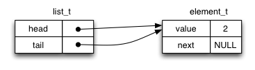

# Lab 7: Testing and Lists

#### Testing code for correctness; linked lists

### Goals

This lab provides:

1.  practice writing tests to determine the correctness of functions.
2.  implementing operations on linked lists
3.  write an efficient list sort function

### Setup

Note that these instructions no longer include all steps. You should know how to do these things by now. If in doubt, refer to previous lab instructions.

In the terminal:

1.  Fetch the [new material](7.zip) for Lab 7 and save it into your local repo.
2.  Expand it into your local repo. This will create the directory '7' containing the files you need.
3.  Add the new directory to your repo with

    <pre>$ git add 7</pre>

    then make '7' your working directory.

Make sure you read and understand the Guide section below. Linked lists have been described in CMPT 125, but it doesn't hurt to see them again.

### Drawing - A tool for thinking

Drawing diagrams like those below is very helpful before writing code that modifies lists. In general, sketching machines - including code - is a tool for thinking: even if you think you know what you are doing, drawing out the operations is a concrete test of your understanding. Even very experienced people with great intuition use drawings for thinking.

Figure 1 - Diagram by Leonardo da Vinci

Figure 2 - Feynman Diagram

* * *

## Guide: Linked Lists

**Linked lists** are data structures that contain a sequence of data elements, like arrays, but with different dynamic properties.

The key idea in the linked list is to use a simple data structure to store each data element along with a pointer to the next element in the list. The end of the list is denoted by NULL next-pointer.

Our implementation is typical in that it uses a second data structure called a **header** to store pointers to the first (head) and last (tail) elements in the list.

The list is assembled as follows:

First a <tt>list_t</tt> structure is allocated on the heap, with its head- and tail-pointers set to NULL, representing an empty list.

To insert the first value into the list, a new <tt>element_t</tt> is allocated on the heap, the value is stored in it, and the header's head- and tail-pointers are both set to point to it. The first element's next-pointer is NULL to indicate it is the last element in the list.

When a subsequent element is added, the next-pointer of the tail element and the tail-pointer of the header are both changed to the address of the new element:

One more addition using the same mechanism. Notice that the tail element always has its next-pointer set to NULL.

Notice that the head- and tail-pointers can be used to add elements to the beginning or end of the list in constant time (O(1)), in contrast to extending native C arrays which in general takes time proportional to the number of elements in the array, i.e. O(n).

Also, given a pointer to any element, an element can be inserted _after it_ in constant time.

However, looking up a list element by its position in the list, like an array index, takes time proportional to its position in the list, i.e. O(n). List elements are therefore best accessed in order, since accessing the next element takes constant time.

A common variant is the **double-linked list** in which every element contains a previous-pointer in addition to the next-pointer. Double-linked lists can be traversed forwards and backwards, at the cost of a little more storage space per element.

It is important to note that while lists have good theoretical resizing properties, iterating over elements in a list can be much slower than iterating over C arrays due to the cache behaviour of current computer architectures. C arrays guarantee that elements are contiguous in memory, making very effective use of the cache. We will talk about cache behaviour later in labs.

## Tasks 1..5

The compressed file you downloaded contains a header file <tt>list.h</tt> that contains an interface specification for a linked-list-of-integers data structure. See the Guide above for notes on linked lists. Six slightly different implementations are provided, in files <tt>tN.c</tt> where N = [1..5]. The file <tt>main.c</tt> contains a very weak test program for the linked list code.

The <tt>Makefile</tt> will build programs t1 through t5, each linking the same <tt>main.c</tt> with one of the list implementation C files.

Build each program by naming it as your 'make' target, e.g.

<pre>$ make t1
$ make t5
</pre>

The above two make commands will each create an executable 't1' and 't5'. You can also build all programs by using the following command:

<pre>$ make all</pre>

Running the resulting programs, you will see that every one passes the test in <tt>main.c</tt>. At this point the beginner might relax and load up Minecraft. But we have left blissful ignorance behind us. We are suspicious. In fact all of these implementations contain bugs.

Your task is to extend <tt>main.c</tt> to thoroughly test the list implementations. Your program must reliably distinguish all these faulty implementations from a correct one.

The grading robot tests work as follows: Your <tt>main.c</tt> will be compiled with each of tN.c as well as a bug-free version (not supplied to you). You pass Task N if your program consistently returns 1 when it runs the buggy code, but 0 when it runs the bug-free code. Remember: returning 1 means an error has occured during the execution of your program while returning 0 means that your program successfully executed.

### Requirements

1.  A program built from your <tt>main.c</tt> and linked against any implementation of the functions in <tt>list.h</tt> must return 0 if the functions are bug-free, or 1 if they contain one or more bugs.
2.  Preferably, your program should not crash or halt on <tt>assert()</tt>. But a crash (e.g., segmentation fault) or assertion will be recorded as indicating the code contained bugs, just like with the grading robot.
3.  Preferably, print an explanatory error message on stdout describing the problem you discovered.
4.  You may produce (a sensible amount) of other text output on stdout or stderr if you wish.
5.  The grading robot will not test your text output: only the return value. Try to make the text output helpful for yourself or an instructor/TA helping you.

### Submission

Commit a revised version of <tt>main.c</tt>. This will be linked against each of the buggy list implementations <tt>tN.c</tt> used by the grading robot in the same way you did locally. The grading robot also has a correct version of the code. Your program should return zero when linked to the correct code, and non-zero when linked to any of the buggy versions.

Task N will be passed if your program can reliably distinguish between a buggy and correct version of the code. To test reliability, your test program will be run several times. It must correctly detect bugs or no-bugs every time.

## Task 6

### Requirements

1.  Commit a new file called <tt>list.c</tt> containing correct implementations of all the functions described in <tt>list.h</tt>.
2.  You may use any piece(s) of the supplied code, or write your own.
3.  Your code should pass all your tests (i.e., the <tt>main.c</tt> you extended in Tasks 1 to 5, and the grading robot's tests.

### Submission

Commit a single C file called <tt>list.c</tt>.

## Task 7

Write a function that sorts an instance of our linked list of integers from smallest to largest value.

### Requirements

1.  Commit a new file called <tt>sort.c</tt> containing at least the function <tt>list_sort()</tt>
2.  Your file must not contain a <tt>main()</tt> function or change the structures in <tt>list.h</tt>.
3.  The function must #include the <tt>list.h</tt> header...
4.  ... and be consistent with the function declaration:

    <pre class="prettyprint"> void list_sort( list_t* list ); </pre>

5.  **Use [an efficient algorithm](http://en.wikipedia.org/wiki/Sorting_algorithm), i.e., an algorithm that sorts in O(n log n)!**
6.  Did you read requirement 5?
7.  Do **not** turn your list into an array, sort it, then turn it back into a list. That's cheating.

### Submission

Commit a single C file called <tt>sort.c</tt>.

* * *

Lab 7 complete. [Back to the course web page](../../).

